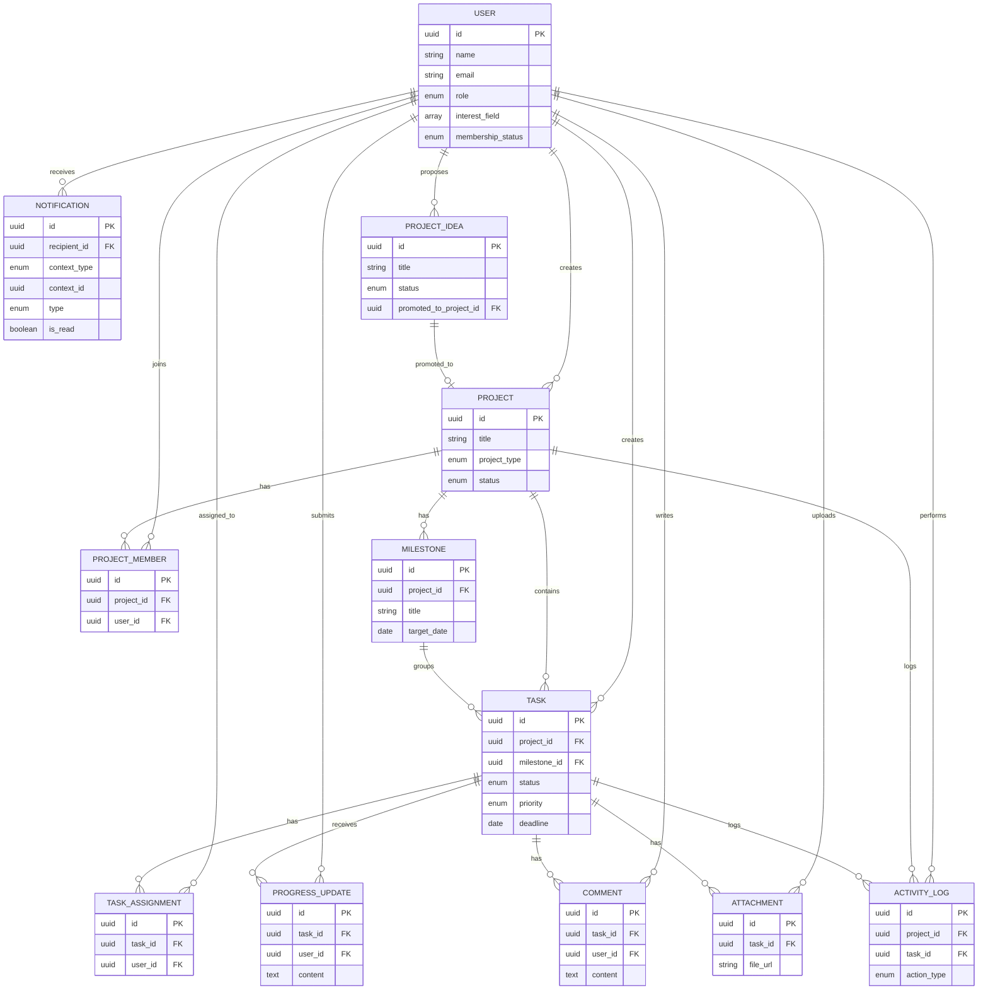
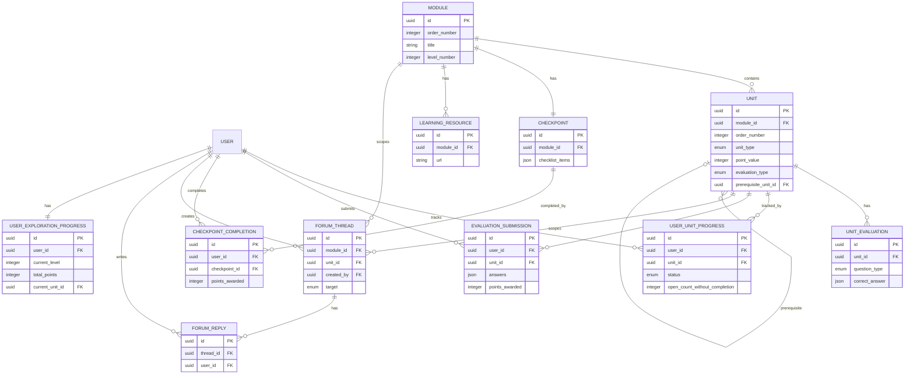
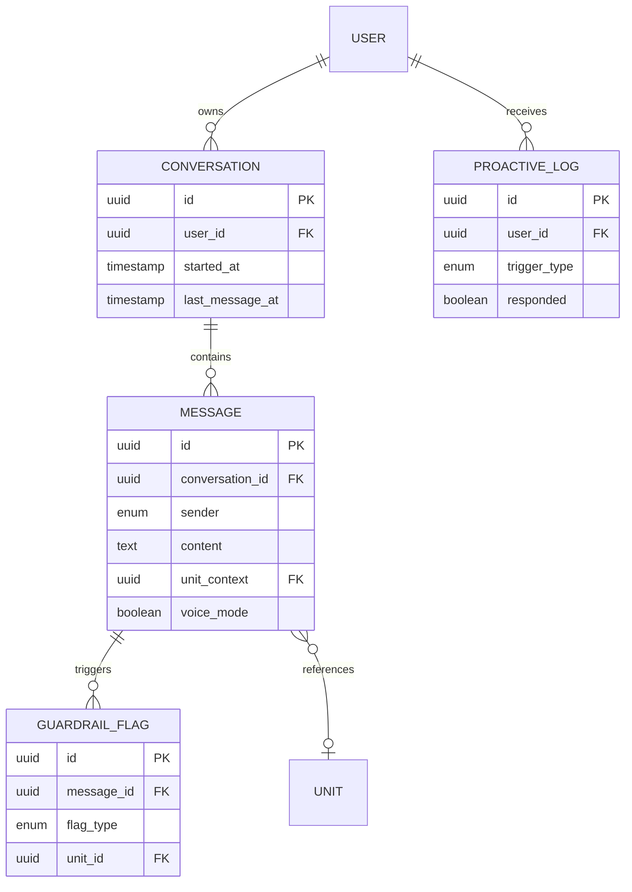
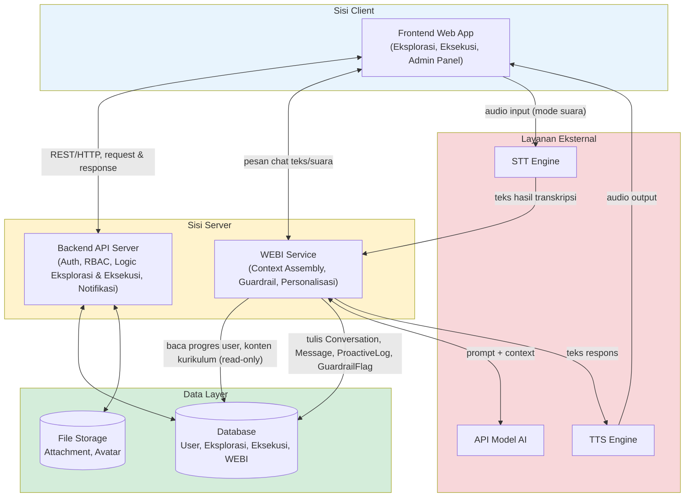

# Perancangan Arsitektur Sistem dan Database WEBI-SPACE

**Tahapan:** 1.7 dari Fase 1: Inisiasi dan Setup
**Status:** Final, sudah di-ACC di tahap outline
**Disusun oleh:** Celo (partner dan coach Ayunda, PIC Divisi Web Development RIT)
**Rujukan:** PRD WEBI-SPACE (1.6), Perancangan Struktur Sistem Eksekusi (1.4), Blueprint Konten Kurikulum Eksplorasi (1.3), Spesifikasi Fungsional WEBI (1.5), Fiksasi Fitur (1.2)

---

## DAFTAR ISI

1. Ringkasan Perubahan dari Skema Eksekusi (1.4)
2. Skema Database Lengkap
   - 2.1 Entitas Lintas Modul
   - 2.2 Entitas Modul Eksekusi (reuse dari 1.4)
   - 2.3 Entitas Modul Eksplorasi (baru)
   - 2.4 Entitas Modul WEBI (baru)
3. Diagram ERD (Mermaid)
4. Diagram Arsitektur Aplikasi
5. Catatan Penutup

---

## 1. RINGKASAN PERUBAHAN DARI SKEMA EKSEKUSI (1.4)

Skema Eksekusi di 1.4 diambil apa adanya. Dua penyesuaian eksplisit dilakukan supaya konsisten dengan sistem penuh:

1. **User** yang sebelumnya cuma direferensikan sebagai asumsi di dokumen 1.4, sekarang didefinisikan penuh sebagai entitas lintas modul, dipakai bersama oleh Eksplorasi, Eksekusi, dan WEBI. Tipe `id` tetap uuid, tidak ada perubahan tipe data dari yang sudah diasumsikan di 1.4.
2. **Notification** yang di 1.4 fieldnya `project_id` dan `task_id` (khusus konteks Eksekusi), sekarang digeneralisasi jadi `context_type` + `context_id` supaya satu tabel bisa dipakai lintas modul sesuai PRD 3.0.5 (sistem notifikasi terpadu). Ini bukan desain ulang konsep, cuma generalisasi field konteks supaya tidak perlu nambah kolom nullable baru tiap kali ada modul baru.

Tidak ada perubahan lain di 12 entitas Eksekusi. Field, tipe data, dan relasi antar entitas Eksekusi tetap seperti di 1.4.

---

## 2. SKEMA DATABASE LENGKAP

Catatan umum yang berlaku di seluruh entitas (mengikuti konvensi 1.4):
- Semua entitas punya field `id` (uuid, primary key), `created_at`, dan `updated_at`, kecuali dicatat lain (misalnya entitas append-only yang tidak punya `updated_at`).
- Field `id`, `created_at`, `updated_at` tidak ditulis ulang di tiap tabel untuk menghindari redundansi.
- Tipe data pakai notasi umum (string, text, enum, timestamp, date, uuid, boolean, integer, json) yang bisa diterjemahkan ke tipe spesifik database manapun. Pemilihan database konkret ditentukan di 1.9.

### 2.1 Entitas Lintas Modul

#### 2.1.1 User

Tabel terpusat, dipakai ketiga modul.

| Field | Tipe | Keterangan |
|-------|------|------------|
| id | uuid | PK |
| name | string | Nama lengkap |
| email | string | Unique, dipakai untuk login |
| password_hash | string | Password yang sudah di-hash, tidak pernah disimpan plain text |
| role | enum | `exploration_member`, `execution_member`, `admin`. Satu user satu role pada satu waktu (business rule 5.13 di PRD) |
| avatar_url | string, nullable | URL foto profil, opsional |
| interest_field | array of enum, nullable | Minat bidang: `frontend`, `backend`, `ui_ux`, `analyst`, `pm`, `fullstack`. Diisi saat registrasi, bisa diperbarui kapan saja |
| membership_status | enum | `active`, `inactive`. Status keanggotaan di divisi |
| created_at | timestamp | |
| updated_at | timestamp | |

Catatan: kalau ada perubahan role (misalnya anggota eksplorasi pindah ke eksekusi), data di tabel role lama (UserExplorationProgress, dsb) tetap tersimpan, cuma user tidak lagi mengakses fitur role lama (business rule 5.13).

#### 2.1.2 Notification

Satu sistem notifikasi terpadu untuk seluruh modul (PRD 3.0.5).

| Field | Tipe | Keterangan |
|-------|------|------------|
| id | uuid | PK |
| recipient_id | uuid, FK > User.id | Siapa yang menerima notifikasi |
| context_type | enum | `project`, `task`, `unit`, `checkpoint`, `module`, `forum_thread`, `none`. Menentukan entitas apa yang dirujuk `context_id` |
| context_id | uuid, nullable | ID entitas terkait, dipakai untuk deep link. Null kalau `context_type` = `none` |
| type | enum | Lihat daftar lengkap di Lampiran B. Mencakup jenis dari Eksekusi (task_assigned, dsb) dan Eksplorasi (checkpoint_completed, level_up, dsb) |
| title | string | Judul notifikasi |
| message | string | Isi notifikasi |
| is_read | boolean | Default: false |
| created_at | timestamp | |

---

### 2.2 Entitas Modul Eksekusi (Reuse dari 1.4)

Diambil apa adanya dari dokumen 1.4. Field `User` yang direferensikan di sini merujuk ke entitas User terpusat di 2.1.1.

#### 2.2.1 ProjectIdea

| Field | Tipe | Keterangan |
|-------|------|------------|
| id | uuid | PK |
| title | string | Judul ide |
| description | text | Deskripsi singkat ide |
| purpose | text | Tujuan/relevansi |
| proposed_by | uuid, FK > User.id | Siapa yang mengusulkan |
| status | enum | `draft`, `approved`, `rejected` |
| rejection_reason | text, nullable | Wajib diisi jika status = rejected |
| promoted_to_project_id | uuid, nullable, FK > Project.id | Terisi otomatis saat ide di-approve |
| created_at | timestamp | |
| updated_at | timestamp | |

#### 2.2.2 Project

| Field | Tipe | Keterangan |
|-------|------|------------|
| id | uuid | PK |
| title | string | Judul proyek |
| description | text | Deskripsi detail proyek |
| objective | text | Tujuan proyek yang terukur |
| project_type | enum | `internal`, `competition` |
| status | enum | `planning`, `active`, `on_hold`, `completed`, `archived` |
| originated_from_idea_id | uuid, nullable, FK > ProjectIdea.id | Null jika proyek dibuat langsung |
| start_date | date | Tanggal mulai proyek |
| target_end_date | date | Target tanggal selesai |
| actual_end_date | date, nullable | Diisi saat status jadi completed |
| created_by | uuid, FK > User.id | Admin yang membuat proyek |
| created_at | timestamp | |
| updated_at | timestamp | |

#### 2.2.3 ProjectMember

Relasi many-to-many Project dan User.

| Field | Tipe | Keterangan |
|-------|------|------------|
| id | uuid | PK |
| project_id | uuid, FK > Project.id | |
| user_id | uuid, FK > User.id | |
| joined_at | timestamp | |

Unique constraint: (project_id, user_id)

#### 2.2.4 Milestone

| Field | Tipe | Keterangan |
|-------|------|------------|
| id | uuid | PK |
| project_id | uuid, FK > Project.id | |
| title | string | Judul milestone |
| description | text, nullable | |
| target_date | date | |
| sort_order | integer | Urutan milestone dalam proyek |
| created_at | timestamp | |
| updated_at | timestamp | |

Progres milestone dihitung derived (persentase task done dari total task terhubung), tidak disimpan sebagai field.

#### 2.2.5 Task

| Field | Tipe | Keterangan |
|-------|------|------------|
| id | uuid | PK |
| project_id | uuid, FK > Project.id | |
| milestone_id | uuid, FK > Milestone.id | Wajib terhubung ke satu milestone |
| title | string | |
| description | text, nullable | |
| status | enum | `todo`, `in_progress`, `in_review`, `done` |
| priority | enum | `low`, `medium`, `high` |
| deadline | date | |
| created_by | uuid, FK > User.id | |
| created_at | timestamp | |
| updated_at | timestamp | |

#### 2.2.6 TaskAssignment

Relasi many-to-many Task dan User.

| Field | Tipe | Keterangan |
|-------|------|------------|
| id | uuid | PK |
| task_id | uuid, FK > Task.id | |
| user_id | uuid, FK > User.id | |
| assigned_by | uuid, FK > User.id | |
| assigned_at | timestamp | |

Unique constraint: (task_id, user_id)

#### 2.2.7 ProgressUpdate

| Field | Tipe | Keterangan |
|-------|------|------------|
| id | uuid | PK |
| task_id | uuid, FK > Task.id | |
| user_id | uuid, FK > User.id | |
| content | text | |
| attachment_url | string, nullable | |
| created_at | timestamp | |

Append-only, tidak ada `updated_at`.

#### 2.2.8 Comment

| Field | Tipe | Keterangan |
|-------|------|------------|
| id | uuid | PK |
| task_id | uuid, FK > Task.id | |
| user_id | uuid, FK > User.id | |
| content | text | |
| created_at | timestamp | |
| updated_at | timestamp | Bisa diedit |

#### 2.2.9 Attachment

| Field | Tipe | Keterangan |
|-------|------|------------|
| id | uuid | PK |
| task_id | uuid, FK > Task.id | |
| uploaded_by | uuid, FK > User.id | |
| file_name | string | Nama file, atau label untuk link/catatan teks |
| file_url | text | Path/URL file, URL link, atau isi catatan teks (widened from string to text in task 2.4 — plain-text notes can exceed 255 chars) |
| file_type | string | MIME type, ekstensi, "link", atau "text" |
| file_size | integer, nullable | Null untuk attachment berupa link atau teks |
| created_at | timestamp | |

Tiga bentuk attachment (file upload, link eksternal, input teks biasa) adalah keputusan tahap 1.2 (Fiksasi Fitur) — detail lengkap tiap bentuk ada di docs/struktur-eksekusi.md 3.10.

#### 2.2.10 ActivityLog

| Field | Tipe | Keterangan |
|-------|------|------------|
| id | uuid | PK |
| project_id | uuid, FK > Project.id | |
| task_id | uuid, nullable, FK > Task.id | Null jika log level proyek |
| user_id | uuid, FK > User.id | |
| action_type | enum | Lihat Lampiran A |
| description | string | |
| metadata | json, nullable | |
| created_at | timestamp | |

Append-only dan immutable (business rule 5.15).

---

### 2.3 Entitas Modul Eksplorasi (Baru)

#### 2.3.1 Module

| Field | Tipe | Keterangan |
|-------|------|------------|
| id | uuid | PK |
| order_number | integer | Urutan modul, 1 sampai 10 |
| title | string | Judul modul |
| description | text | Ringkasan tema modul |
| level_number | integer | Level gamifikasi terkait (1-6), mengikuti pengelompokan modul di sistem level |
| created_at | timestamp | |
| updated_at | timestamp | |

#### 2.3.2 Unit

| Field | Tipe | Keterangan |
|-------|------|------------|
| id | uuid | PK |
| module_id | uuid, FK > Module.id | Unit milik modul mana |
| order_number | integer | Urutan unit dalam modul |
| title | string | Judul unit |
| content | text | Konten materi final, termasuk direktif `[SAJIKAN: ...]` sebagai penanda teknis untuk frontend |
| estimated_minutes | integer | Estimasi waktu pengerjaan, default 15 |
| unit_type | enum | `concept` (10 poin), `practice` (15 poin) |
| point_value | integer | 10 untuk concept, 15 untuk practice |
| evaluation_type | enum | `quiz_multiple_choice`, `quiz_matching`, `quiz_ordering`, `essay`, `practice`, `none` |
| prerequisite_unit_id | uuid, nullable, FK > Unit.id | Self-reference, unit yang harus selesai duluan |
| created_at | timestamp | |
| updated_at | timestamp | |

#### 2.3.3 UnitEvaluation

Bank soal per unit. Satu unit bisa punya lebih dari satu baris (misalnya kuis dengan beberapa soal). Dipakai juga sebagai `EVALUATION_BANK` yang di-inject ke konteks WEBI untuk mekanisme deteksi perlindungan evaluasi (Spesifikasi WEBI 3.3.3).

| Field | Tipe | Keterangan |
|-------|------|------------|
| id | uuid | PK |
| unit_id | uuid, FK > Unit.id | |
| question_type | enum | `multiple_choice`, `matching`, `ordering`, `essay`, `practice` |
| question_text | text | Teks soal atau instruksi praktik |
| options | json, nullable | Opsi jawaban untuk multiple_choice/matching/ordering. Null untuk essay/practice |
| correct_answer | json, nullable | Kunci jawaban untuk auto-grading (multiple_choice/matching/ordering). Null untuk essay/practice karena auto-approve |
| sort_order | integer | Urutan soal dalam unit |
| created_at | timestamp | |
| updated_at | timestamp | |

#### 2.3.4 UserUnitProgress

Status penyelesaian unit per user. Sekaligus jadi sumber data `completed_units`, `current_unit`, `unit_completion_timestamps`, dan `unit_open_count_without_completion` yang dibutuhkan WEBI (Spesifikasi WEBI 7.2).

| Field | Tipe | Keterangan |
|-------|------|------------|
| id | uuid | PK |
| user_id | uuid, FK > User.id | |
| unit_id | uuid, FK > Unit.id | |
| status | enum | `not_started`, `in_progress`, `completed` |
| open_count_without_completion | integer | Default 0. Dipakai untuk deteksi stuck (Trigger 3 WEBI, threshold 3 kali) |
| completed_at | timestamp, nullable | |
| created_at | timestamp | |
| updated_at | timestamp | |

Unique constraint: (user_id, unit_id)

#### 2.3.5 EvaluationSubmission

Jawaban yang dikirim user untuk evaluasi sebuah unit.

| Field | Tipe | Keterangan |
|-------|------|------------|
| id | uuid | PK |
| user_id | uuid, FK > User.id | |
| unit_id | uuid, FK > Unit.id | |
| answers | json | Jawaban terstruktur. Isi bervariasi sesuai evaluation_type: pilihan yang dipilih untuk kuis, teks bebas untuk esai/praktik |
| is_correct | boolean, nullable | Hasil auto-grading untuk tipe kuis. Null untuk esai/praktik karena auto-approve (PRD 5.7) |
| points_awarded | integer | Poin yang diberikan saat submit |
| submitted_at | timestamp | |

#### 2.3.6 Checkpoint

Satu checkpoint per modul, berisi Checklist Akhir Modul, Intermezo, dan Form Tanggapan Modul.

| Field | Tipe | Keterangan |
|-------|------|------------|
| id | uuid | PK |
| module_id | uuid, FK > Module.id, unique | Satu checkpoint per modul |
| checklist_items | json | Daftar item checklist akhir modul |
| intermezo_questions | json | Daftar pertanyaan intermezo (kuis persiapan/pemetaan personal, tanpa jawaban benar/salah) |
| created_at | timestamp | |
| updated_at | timestamp | |

#### 2.3.7 CheckpointCompletion

| Field | Tipe | Keterangan |
|-------|------|------------|
| id | uuid | PK |
| user_id | uuid, FK > User.id | |
| checkpoint_id | uuid, FK > Checkpoint.id | |
| checklist_answers | json | Jawaban checklist per item |
| intermezo_answers | json | Jawaban intermezo |
| form_tanggapan | text | Jawaban Form Tanggapan Modul |
| points_awarded | integer | Default 25 (bonus checkpoint) |
| completed_at | timestamp | |

Unique constraint: (user_id, checkpoint_id)

#### 2.3.8 ForumThread

| Field | Tipe | Keterangan |
|-------|------|------------|
| id | uuid | PK |
| module_id | uuid, nullable, FK > Module.id | Terisi jika thread level modul |
| unit_id | uuid, nullable, FK > Unit.id | Terisi jika thread level unit |
| created_by | uuid, FK > User.id | |
| title | string | |
| content | text | |
| target | enum | `peer`, `pic`. Anggota memilih bertanya ke sesama anggota atau langsung ke PIC |
| created_at | timestamp | |
| updated_at | timestamp | |

Catatan: minimal salah satu dari `module_id`/`unit_id` terisi. Akses forum ini terbatas untuk `exploration_member` dan `admin` saja (PRD 5.16), terpisah total dari forum Eksekusi.

#### 2.3.9 ForumReply

| Field | Tipe | Keterangan |
|-------|------|------------|
| id | uuid | PK |
| thread_id | uuid, FK > ForumThread.id | |
| user_id | uuid, FK > User.id | |
| content | text | |
| created_at | timestamp | |
| updated_at | timestamp | |

#### 2.3.10 LearningResource

| Field | Tipe | Keterangan |
|-------|------|------------|
| id | uuid | PK |
| module_id | uuid, FK > Module.id | |
| title | string | Judul referensi |
| url | string | Link sumber |
| source_name | string | Nama sumber, contoh: "MDN Web Docs", "roadmap.sh", "Pro Git Book" |
| created_at | timestamp | |
| updated_at | timestamp | |

Jadi single source of truth, dipakai baik oleh fitur Learning Resource Repository di UI maupun sebagai input `supplementary_resources` saat proses ekspor dataset WEBI.

#### 2.3.11 UserExplorationProgress

Ringkasan progres gamifikasi per user, di-update transaksional tiap kali ada poin baru (submit evaluasi atau checkpoint selesai). Dipisah dari agregasi manual supaya WEBI bisa baca cepat tanpa hitung ulang tiap request (dibutuhkan di hampir tiap request WEBI, lihat Spesifikasi WEBI 7.2).

| Field | Tipe | Keterangan |
|-------|------|------------|
| id | uuid | PK |
| user_id | uuid, FK > User.id, unique | Relasi 1-1 ke User |
| current_level | integer | 1 sampai 6 |
| level_name | string | Pengenal / Penyiap / Kolaborator / Perakit / Praktisi / Lulusan Eksplorasi |
| total_points | integer | Default 0 |
| current_unit_id | uuid, nullable, FK > Unit.id | Posisi terakhir/unit yang sedang dikerjakan |
| updated_at | timestamp | |

Catatan: data ini adalah ringkasan yang bisa direkonstruksi ulang dari UserUnitProgress dan CheckpointCompletion kalau suatu saat meragukan, karena kedua tabel itu tetap jadi audit trail lengkap.

---

### 2.4 Entitas Modul WEBI (Baru)

Berdasarkan kebutuhan data di Spesifikasi Fungsional WEBI (1.5) bagian 7.4. WEBI read-only terhadap seluruh data Eksplorasi di atas (business rule 5.9), dan hanya menulis ke empat entitas berikut.

#### 2.4.1 Conversation

| Field | Tipe | Keterangan |
|-------|------|------------|
| id | uuid | PK |
| user_id | uuid, FK > User.id | |
| started_at | timestamp | |
| last_message_at | timestamp | |

#### 2.4.2 Message

| Field | Tipe | Keterangan |
|-------|------|------------|
| id | uuid | PK |
| conversation_id | uuid, FK > Conversation.id | |
| sender | enum | `user`, `webi` |
| content | text | |
| unit_context | uuid, nullable, FK > Unit.id | Unit yang sedang dibahas/jadi konteks saat pesan dikirim |
| voice_mode | boolean | Default false. True jika pesan berasal dari/dikirim lewat interaksi suara |
| created_at | timestamp | |

#### 2.4.3 ProactiveLog

| Field | Tipe | Keterangan |
|-------|------|------------|
| id | uuid | PK |
| user_id | uuid, FK > User.id | |
| trigger_type | enum | `onboarding`, `stagnation`, `stuck`, `level_up`, `checkpoint` (sesuai Trigger 1-5 di Spesifikasi WEBI) |
| sent_at | timestamp | |
| responded | boolean | Default false |
| responded_at | timestamp, nullable | |

#### 2.4.4 GuardrailFlag

| Field | Tipe | Keterangan |
|-------|------|------------|
| id | uuid | PK |
| message_id | uuid, FK > Message.id | |
| flag_type | enum | `eval_detection`, `domain_rejection`, `output_validation` |
| unit_id | uuid, nullable, FK > Unit.id | Unit terkait, kalau relevan (misalnya deteksi evaluasi) |
| details | json | Detail tambahan, contoh: soal yang ter-trigger, similarity score |
| created_at | timestamp | |

---

## LAMPIRAN A: DEFINISI action_type ActivityLog

Diambil apa adanya dari 1.4, khusus modul Eksekusi.

| action_type | Trigger |
|-------------|---------|
| `idea_created` | Anggota/admin menginput ide baru |
| `idea_approved` | Admin meng-approve ide |
| `idea_rejected` | Admin me-reject ide |
| `project_created` | Proyek baru dibuat |
| `project_status_changed` | Status proyek berubah |
| `project_member_added` | Anggota ditambahkan ke proyek |
| `project_member_removed` | Anggota dikeluarkan dari proyek |
| `milestone_created` | Milestone baru dibuat |
| `task_created` | Task baru dibuat |
| `task_status_changed` | Status task berubah |
| `task_assigned` | Task di-assign ke anggota |
| `task_reassigned` | Task di-re-assign |
| `task_deadline_changed` | Deadline task diubah |
| `task_priority_changed` | Prioritas task diubah |
| `task_deleted` | Task dihapus |
| `comment_added` | Komentar baru di task |
| `attachment_added` | Attachment baru di task |
| `progress_update_added` | Progress update baru di task |

## LAMPIRAN B: DEFINISI type Notification

Digabung dari trigger Eksekusi (1.4) dan trigger Eksplorasi (PRD 3.1.8), dipetakan ke `context_type`/`context_id` yang sudah digeneralisasi.

**Dari Eksekusi (context_type: `project`/`task`):**

| type | Trigger |
|------|---------|
| `task_assigned` | Task di-assign ke anggota |
| `task_reassigned_to` | Task di-re-assign, ke anggota baru |
| `task_reassigned_from` | Task di-re-assign, dari anggota lama |
| `task_deadline_approaching` | Deadline task tinggal <= threshold hari |
| `task_overdue` | Deadline task terlewat |
| `task_status_to_review` | Task berpindah ke in_review |
| `task_revision_needed` | Task dikembalikan ke in_progress dari in_review |
| `comment_from_admin` | Admin menambahkan komentar di task |
| `comment_on_my_task` | Ada komentar baru di task yang di-assign ke user |
| `progress_update_received` | Anggota mengirim progress update (untuk admin) |
| `idea_status_changed` | Ide di-approve atau di-reject |
| `added_to_project` | Anggota ditambahkan ke proyek |
| `project_status_changed` | Status proyek berubah |
| `stalled_task_alert` | Task terdeteksi STALLED (untuk admin) |
| `inactive_member_alert` | Anggota terdeteksi INACTIVE (untuk admin) |
| `idea_created_alert` | Ide baru diinput (untuk admin) |

**Dari Eksplorasi (context_type: `checkpoint`/`unit`/`module`/`forum_thread`):**

| type | Trigger |
|------|---------|
| `checkpoint_completed` | Checkpoint modul tercapai |
| `level_up` | Naik level |
| `new_unit_unlocked` | Unit baru tersedia setelah menyelesaikan unit sebelumnya |
| `evaluation_reminder` | Pengingat tugas/evaluasi belum selesai |
| `forum_reply_received` | Ada balasan di thread forum yang diikuti anggota |
| `custom_reminder` | Reminder personal custom (fitur pelengkap) |

---

## 3. DIAGRAM ERD

Dipecah tiga diagram supaya terbaca: Lintas Modul + Eksekusi, Eksplorasi, dan WEBI. Ketiganya terhubung lewat entitas User yang sama.

### 3.1 ERD Lintas Modul dan Eksekusi

### 3.2 ERD Eksplorasi

### 3.3 ERD WEBI

---

## 4. DIAGRAM ARSITEKTUR APLIKASI

### 4.1 Komponen Sistem

**Frontend.** Web app responsive tunggal, diakses ketiga role (exploration_member, execution_member, admin). Tampilan dan akses fitur diatur RBAC berdasarkan field `role` di tabel User. Tidak ada aplikasi native terpisah (batasan sistem 6.1).

**Backend/API Server.** Menangani seluruh logic bisnis: autentikasi dan RBAC, logic Eksplorasi (progress tracker, gamifikasi, evaluasi, forum), logic Eksekusi (project, task, Kanban, monitoring admin, alert flags), dan sistem notifikasi terpadu. Backend adalah satu-satunya pihak yang menulis ke seluruh tabel Eksplorasi dan Eksekusi.

**Database.** Satu database relasional menampung seluruh skema di Bagian 2.

**WEBI Service.** Layer terpisah secara logis dari backend utama, walau bisa satu deployment. Tugasnya merakit context sebelum memanggil model AI: USER_CONTEXT (dari User + UserExplorationProgress), CONVERSATION_HISTORY (dari Message, 20 pesan terakhir sesuai parameter configurable), RELEVANT_CURRICULUM_CONTENT (dari Unit.content, di-retrieve berdasarkan similarity), dan EVALUATION_BANK (dari UnitEvaluation, untuk deteksi perlindungan evaluasi). WEBI Service read-only terhadap seluruh data Eksplorasi, dan hanya menulis ke Conversation, Message, ProactiveLog, GuardrailFlag (business rule 5.9).

**API Model AI Eksternal.** Provider LLM yang diintegrasikan lewat API, bukan model yang dilatih sendiri (batasan sistem 6.1). Pemilihan provider konkret di tahap 1.9.

**Integrasi STT/TTS.** Lapisan konversi suara di atas dan di bawah pipeline teks WEBI Service yang sama. STT mengubah input suara user jadi teks sebelum masuk ke pipeline biasa, TTS mengubah respons teks WEBI jadi suara sebelum dikirim balik. Guardrail berlaku identik di kedua mode (Spesifikasi WEBI 3.3.10).

**File Storage.** Menyimpan file attachment Eksekusi dan avatar profil. Backend menyimpan referensi URL-nya di tabel Attachment dan User.

### 4.2 Diagram Arsitektur

### 4.3 Alur Data: Kasus WEBI (Multi-Sumber)

Kasus ini paling kompleks karena satu request butuh data dari beberapa sumber sekaligus.

1. User mengirim pesan lewat chat (teks langsung, atau suara yang lebih dulu masuk STT untuk ditranskripsi jadi teks).
2. Backend/WEBI Service menerima teks pesan, mengecek rate limit (maks 50 pesan/hari/user).
3. WEBI Service merakit context dari beberapa sumber secara paralel:
   - Baca `User` dan `UserExplorationProgress` untuk USER_CONTEXT (nama, level, poin, current_unit, interest_field).
   - Baca `Message` (20 pesan terakhir dari `Conversation` aktif) untuk CONVERSATION_HISTORY.
   - Baca `Unit.content` yang relevan (berdasarkan current_unit atau similarity terhadap pertanyaan) untuk RELEVANT_CURRICULUM_CONTENT.
   - Baca `UnitEvaluation` dari unit terkait untuk EVALUATION_BANK.
4. Context digabung dengan system prompt statis (persona, batasan domain, instruksi perlindungan evaluasi), lalu dikirim ke API Model AI.
5. Respons dari model AI diperiksa backend (Layer 2 guardrail): cek similarity terhadap kunci jawaban di EVALUATION_BANK, cek domain. Kalau lolos ke `GuardrailFlag` dengan `flag_type` sesuai, respons di-retry dengan instruksi tambahan sebelum dikirim ke user.
6. Respons final disimpan sebagai `Message` baru (sender: webi), `last_message_at` di `Conversation` di-update.
7. Kalau mode suara, respons teks diproses TTS jadi audio sebelum dikirim ke frontend.
8. Kalau ini bagian dari sapaan proaktif (bukan respons langsung ke user), entry baru ditambahkan ke `ProactiveLog` dengan `trigger_type` yang sesuai.

---

## 5. CATATAN PENUTUP

Dokumen ini mencakup dua deliverable yang diminta di 1.7:

1. **Skema database lengkap** (Bagian 2): 27 entitas total, terdiri dari 2 entitas lintas modul (1 baru, 1 hasil generalisasi dari 1.4), 10 entitas Eksekusi (reuse murni dari 1.4), 11 entitas Eksplorasi (baru), dan 4 entitas WEBI (baru). Seluruh relasi dan kardinalitas dituangkan dalam tiga diagram ERD di Bagian 3.

2. **Diagram arsitektur aplikasi** (Bagian 4): tujuh komponen (Frontend, Backend API, WEBI Service, Database, File Storage, API Model AI, STT/TTS) dengan penjelasan tiap komponen dan alur data detail untuk kasus WEBI yang butuh multi-sumber data.

Dua penyesuaian eksplisit terhadap skema Eksekusi 1.4 (User jadi entitas penuh, Notification digeneralisasi) sudah dicatat di Bagian 1, bukan diam-diam diubah.

Siap menjadi acuan untuk tahap selanjutnya: 1.8 Desain UI/UX dan 1.9 Pemilihan Tech Stack.