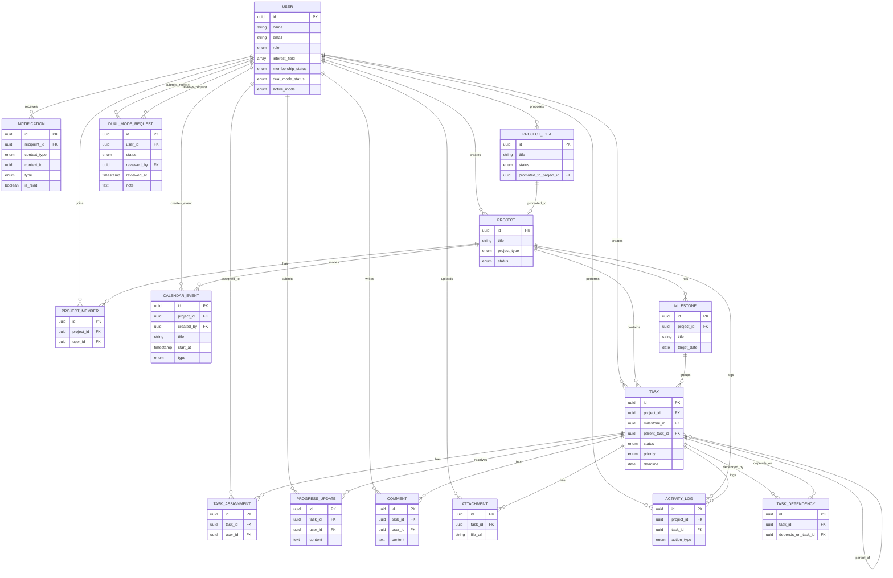
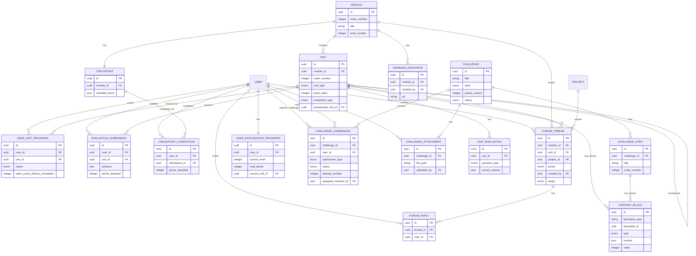
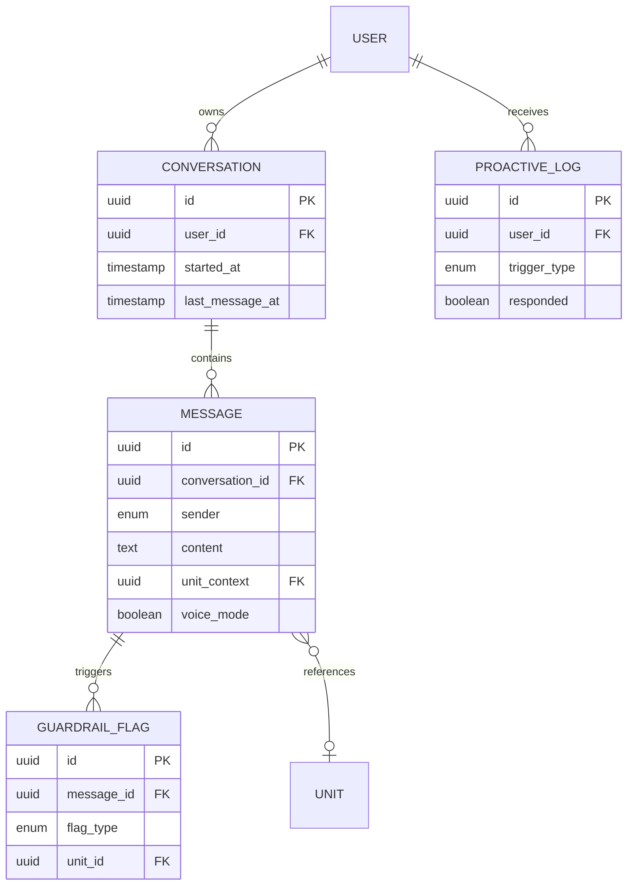
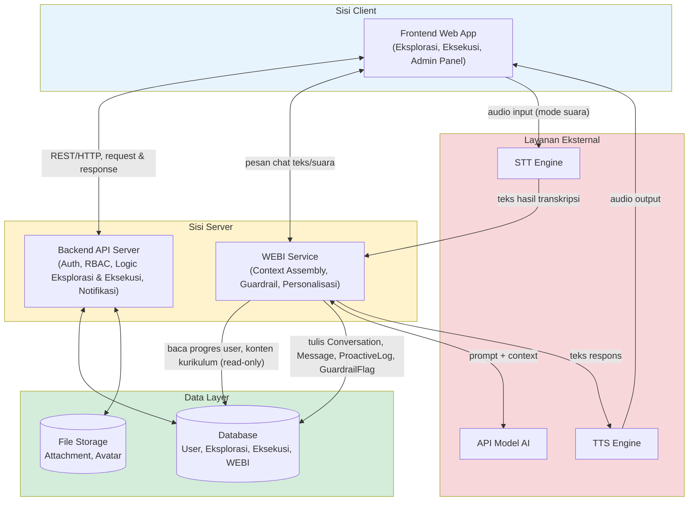

# Perancangan Arsitektur Sistem dan Database WEBI-SPACE

**Tahapan:** 1.7 dari Fase 1: Inisiasi dan Setup — **diperbarui 2026-07-13** untuk mencerminkan skema gabungan v1.0 + v2.0 (satu database yang sama, bukan dua versi terpisah — lihat Bagian 0).
**Status:** Final v1.0 (di-ACC di tahap outline) + diperluas non-destruktif sepanjang v2.0 (Fase 3–8). Seluruh field v1.0 di bawah TETAP seperti semula kecuali disebutkan eksplisit sebagai perubahan v2.0.
**Disusun oleh:** Celo (partner dan coach Ayunda, PIC Divisi Web Development RIT) — bagian v1.0. Bagian pembaruan v2.0 disusun ulang langsung dari isi migrasi asli (`database/migrations/*.php`), bukan dari ingatan/ekstrapolasi dokumen lain, per task "Update arsitektur-database.md ke Skema Terkini".
**Rujukan:** PRD WEBI-SPACE (1.6), Perancangan Struktur Sistem Eksekusi (1.4), Blueprint Konten Kurikulum Eksplorasi (1.3), Spesifikasi Fungsional WEBI (1.5), Fiksasi Fitur (1.2) — untuk v1.0. `docs/v_2.0/archive/sumber-konsolidasi/RANCANGAN_FINAL_WEBI-SPACE_v2.md`, `docs/v_2.0/archive/sumber-konsolidasi/Rancangan_Arsitektur_Konten_Dinamis_v2.md`, `docs/v_2.0/archive/sumber-konsolidasi/Rancangan_Modul_Manajemen_Proyek_v2.md`, `docs/v_2.0/archive/sumber-konsolidasi/Rancangan_Modul_Praktik_v2.md`, `docs/v_2.0/archive/sumber-konsolidasi/content-blocks-spec.md` — untuk v2.0.

---

## DAFTAR ISI

0. Catatan Skema Gabungan v1.0 + v2.0 (baru)
1. Ringkasan Perubahan dari Skema Eksekusi (1.4)
2. Skema Database Lengkap
   - 2.1 Entitas Lintas Modul
   - 2.2 Entitas Modul Eksekusi (reuse dari 1.4 + tambahan v2.0)
   - 2.3 Entitas Modul Eksplorasi (baru di v1.0 + tambahan v2.0: Konten Dinamis, Praktik)
   - 2.4 Entitas Modul WEBI (baru, tidak berubah di v2.0)
3. Diagram ERD (Mermaid)
4. Diagram Arsitektur Aplikasi
5. Catatan Penutup

---

## 0. CATATAN SKEMA GABUNGAN v1.0 + v2.0

Dokumen ini awalnya (1.7) murni skema v1.0. Sepanjang pengerjaan v2.0 (Fase 3 sampai Fase 8, Juli 2026), database yang SAMA — bukan database terpisah — diperluas lewat serangkaian migrasi additif: **8 tabel benar-benar baru**, dan **5 tabel v1.0 yang sudah ada mendapat kolom tambahan**. Tidak pernah ada migrasi yang menghapus/mengganti tipe data kolom v1.0 secara mengejutkan — semua perubahan terhadap tabel lama dikonfirmasi eksplisit ke Aye dulu sebelum dieksekusi (`nullOnDelete`, pelebaran enum, dsb — pola yang konsisten dicatat di komentar tiap file migrasi).

Bagian 2 di bawah sekarang jadi **satu daftar tunggal untuk skema NYATA saat ini** (bukan snapshot v1.0 yang sudah usang) — setiap tabel baru v2.0 ditandai eksplisit **[BARU v2.0]**, dan setiap kolom baru pada tabel v1.0 ditandai **[+v2.0]** di kolom Keterangan. Total entitas naik dari 27 (v1.0) jadi **35** (v1.0 + 8 baru v2.0).

**Sumber kebenaran**: seluruh isi Bagian 2 diverifikasi ulang langsung dari `database/migrations/*.php` (49 file migrasi, dibaca satu-satu, bukan dari `RANCANGAN_FINAL_WEBI-SPACE_v2.md` atau dokumen rancangan lain yang levelnya lebih tinggi/kurang presisi soal tipe kolom persis). Kalau ada perbedaan antara dokumen rancangan v2.0 dan isi bagian ini, **isi migrasi asli yang menang** — dokumen rancangan levelnya "kenapa", migrasi levelnya "apa persisnya".

---

## 1. RINGKASAN PERUBAHAN DARI SKEMA EKSEKUSI (1.4)

Skema Eksekusi di 1.4 diambil apa adanya. Dua penyesuaian eksplisit dilakukan supaya konsisten dengan sistem penuh:

1. **User** yang sebelumnya cuma direferensikan sebagai asumsi di dokumen 1.4, sekarang didefinisikan penuh sebagai entitas lintas modul, dipakai bersama oleh Eksplorasi, Eksekusi, dan WEBI. Tipe `id` tetap uuid, tidak ada perubahan tipe data dari yang sudah diasumsikan di 1.4.
2. **Notification** yang di 1.4 fieldnya `project_id` dan `task_id` (khusus konteks Eksekusi), sekarang digeneralisasi jadi `context_type` + `context_id` supaya satu tabel bisa dipakai lintas modul sesuai PRD 3.0.5 (sistem notifikasi terpadu). Ini bukan desain ulang konsep, cuma generalisasi field konteks supaya tidak perlu nambah kolom nullable baru tiap kali ada modul baru.

Tidak ada perubahan lain di 12 entitas Eksekusi pada rilis v1.0. (Perubahan v2.0 terhadap beberapa entitas Eksekusi — `tasks.parent_task_id`, dan 2 tabel Eksekusi baru — dicatat di 2.2 di bawah, bukan di sini karena bukan bagian ringkasan 1.7 asli.)

---

## 2. SKEMA DATABASE LENGKAP

Catatan umum yang berlaku di seluruh entitas (mengikuti konvensi 1.4):
- Semua entitas punya field `id` (uuid, primary key), `created_at`, dan `updated_at`, kecuali dicatat lain (misalnya entitas append-only yang tidak punya `updated_at`).
- Field `id`, `created_at`, `updated_at` tidak ditulis ulang di tiap tabel untuk menghindari redundansi.
- Tipe data pakai notasi umum (string, text, enum, timestamp, date, uuid, boolean, integer, json) yang bisa diterjemahkan ke tipe spesifik database manapun. Database konkret yang dipakai: MySQL (ditentukan di 1.9).

### 2.1 Entitas Lintas Modul

#### 2.1.1 User

Tabel terpusat, dipakai ketiga modul.

| Field | Tipe | Keterangan |
|-------|------|------------|
| id | uuid | PK |
| name | string | Nama lengkap |
| email | string | Unique, dipakai untuk login |
| password_hash | string | Password yang sudah di-hash, tidak pernah disimpan plain text |
| role | enum | `exploration_member`, `execution_member`, `admin`. Role ASAL, tidak pernah berubah (business rule 5.13 di PRD) — tetap satu-satunya sumber identitas dasar bahkan setelah Mode Ganda ada di v2.0 |
| avatar_url | string, nullable | URL foto profil, opsional |
| interest_field | array of enum, nullable | Minat bidang: `frontend`, `backend`, `ui_ux`, `analyst`, `pm`, `fullstack`. Diisi saat registrasi, bisa diperbarui kapan saja |
| membership_status | enum | `active`, `inactive`. Status keanggotaan di divisi |
| dual_mode_status | enum, default `none` | **[+v2.0, Fase 8 Batch 1]** `none`, `pending`, `approved`, `revoked`. Status EFEKTIF TERKINI akses Mode Ganda milik user ini — cuma bermakna untuk `role = exploration_member` (lihat `dual_mode_requests` untuk riwayat lengkap tiap pengajuan). Nilai `revoked` masih sah secara skema tapi sejak perbaikan pasca-Batch-5 tidak pernah lagi ditulis oleh aplikasi (`revoke()` sekarang mengembalikan status ke `none` supaya bisa mengajukan ulang, riwayat pencabutan disimpan permanen sebagai baris `dual_mode_requests` tersendiri) |
| active_mode | enum, nullable | **[+v2.0, Fase 8 Batch 1]** `exploration`, `execution`. Null = "ikuti role asal" (kasus default/mayoritas user). Cuma bermakna untuk `exploration_member` yang `dual_mode_status = approved` — menentukan mode mana yang sedang aktif dipakai, diubah sendiri oleh user lewat menu Akun (`SwitchModeController`, Batch 6) |
| created_at | timestamp | |
| updated_at | timestamp | |

Catatan: kalau ada perubahan role (misalnya anggota eksplorasi pindah ke eksekusi), data di tabel role lama (UserExplorationProgress, dsb) tetap tersimpan, cuma user tidak lagi mengakses fitur role lama (business rule 5.13). **[+v2.0]** Mode Ganda TIDAK mengubah `role` — anggota yang disetujui akses Eksekusi tetap `exploration_member` selamanya, cuma mendapat akses TAMBAHAN (lihat Gate `User::canAccessExecution()`/`canAccessExploration()`, bukan bagian skema, dicatat di sini sebagai konteks).

#### 2.1.2 Notification

Satu sistem notifikasi terpadu untuk seluruh modul (PRD 3.0.5).

| Field | Tipe | Keterangan |
|-------|------|------------|
| id | uuid | PK |
| recipient_id | uuid, FK > User.id | Siapa yang menerima notifikasi |
| context_type | enum | `project`, `task`, `unit`, `checkpoint`, `module`, `forum_thread`, `challenge_submission` **[+v2.0]**, `none`. Menentukan entitas apa yang dirujuk `context_id`. Morph map terdaftar di `AppServiceProvider` (alias di atas → nama kelas Eloquent) |
| context_id | uuid, nullable | ID entitas terkait, dipakai untuk deep link. Null kalau `context_type` = `none` |
| type | enum | Lihat daftar lengkap di Lampiran B (diperluas 3 kali di v2.0: Praktik, lalu Mode Ganda) |
| title | string | Judul notifikasi |
| message | string | Isi notifikasi |
| is_read | boolean | Default: false |
| created_at | timestamp | |

#### 2.1.3 DualModeRequest **[BARU v2.0, Fase 8 Batch 1]**

Audit trail SETIAP pengajuan akses Mode Ganda — bisa lebih dari satu baris per user seiring waktu (ditolak → mengajukan ulang → disetujui → suatu saat dicabut, dst). Terpisah dari `users.dual_mode_status` yang cuma menyimpan status EFEKTIF TERKINI, supaya pengecekan Gate cukup baca satu kolom terindeks tanpa join/agregasi.

| Field | Tipe | Keterangan |
|-------|------|------------|
| id | uuid | PK |
| user_id | uuid, FK > User.id | Pengaju |
| status | enum, default `pending` | `pending`, `approved`, `rejected`, `revoked` (nilai `revoked` ditambah belakangan — dipakai untuk baris riwayat PENCABUTAN itu sendiri, bukan status pengajuan asli mana pun) |
| reviewed_by | uuid, nullable, FK > User.id | Admin yang memutuskan (atau mencabut) |
| reviewed_at | timestamp, nullable | Sekaligus jadi guard "sudah pernah diputuskan" di level aplikasi |
| note | text, nullable | Alasan penolakan (opsional, ditampilkan ke member) |
| created_at | timestamp | |
| updated_at | timestamp | |

Catatan penting: enum `status` di sini **asimetris** dengan `users.dual_mode_status` — tabel ini TIDAK punya nilai `none`, tabel `users` TIDAK pernah menyimpan `rejected` (skemanya cuma `none`/`pending`/`approved`/`revoked`). Reject DAN revoke keduanya mengembalikan `users.dual_mode_status` ke `none` (supaya bisa mengajukan ulang), tapi peristiwanya sendiri tetap permanen tercatat di sini sebagai baris `status = rejected` atau `status = revoked`.

---

### 2.2 Entitas Modul Eksekusi

Entitas 2.2.1–2.2.10 diambil apa adanya dari dokumen 1.4 (tidak berubah sepanjang v1.0). Field `User` yang direferensikan di sini merujuk ke entitas User terpusat di 2.1.1. Dua entitas baru (2.2.11, 2.2.12) ditambahkan di v2.0 (Fase 7).

#### 2.2.1 ProjectIdea

| Field | Tipe | Keterangan |
|-------|------|------------|
| id | uuid | PK |
| title | string | Judul ide |
| description | text | Deskripsi singkat ide |
| purpose | text | Tujuan/relevansi |
| proposed_by | uuid, FK > User.id | Siapa yang mengusulkan |
| status | enum | `draft`, `approved`, `rejected` |
| rejection_reason | text, nullable | Wajib diisi jika status = rejected |
| promoted_to_project_id | uuid, nullable, FK > Project.id | Terisi otomatis saat ide di-approve |
| created_at | timestamp | |
| updated_at | timestamp | |

#### 2.2.2 Project

| Field | Tipe | Keterangan |
|-------|------|------------|
| id | uuid | PK |
| title | string | Judul proyek |
| description | text | Deskripsi detail proyek |
| objective | text | Tujuan proyek yang terukur |
| project_type | enum | `internal`, `competition` |
| status | enum | `planning`, `active`, `on_hold`, `completed`, `archived` |
| originated_from_idea_id | uuid, nullable, FK > ProjectIdea.id | Null jika proyek dibuat langsung |
| start_date | date | Tanggal mulai proyek |
| target_end_date | date | Target tanggal selesai |
| actual_end_date | date, nullable | Diisi saat status jadi completed |
| created_by | uuid, FK > User.id | Admin yang membuat proyek |
| created_at | timestamp | |
| updated_at | timestamp | |

#### 2.2.3 ProjectMember

Relasi many-to-many Project dan User.

| Field | Tipe | Keterangan |
|-------|------|------------|
| id | uuid | PK |
| project_id | uuid, FK > Project.id | |
| user_id | uuid, FK > User.id | |
| joined_at | timestamp | |

Unique constraint: (project_id, user_id). **Catatan v2.0**: sengaja TETAP tanpa kolom peran/jabatan per proyek (keputusan berjalan, lihat `docs/v_2.0/RECON_project_member_peran.md` — menambah kolom ini butuh konfirmasi eksplisit terpisah, belum pernah diminta).

#### 2.2.4 Milestone

| Field | Tipe | Keterangan |
|-------|------|------------|
| id | uuid | PK |
| project_id | uuid, FK > Project.id | |
| title | string | Judul milestone |
| description | text, nullable | |
| target_date | date | |
| sort_order | integer | Urutan milestone dalam proyek |
| created_at | timestamp | |
| updated_at | timestamp | |

Progres milestone dihitung derived (persentase task **besar** — `parent_task_id IS NULL`, lihat 2.2.5 — yang done dari total task besar terhubung), tidak disimpan sebagai field.

#### 2.2.5 Task

| Field | Tipe | Keterangan |
|-------|------|------------|
| id | uuid | PK |
| project_id | uuid, FK > Project.id | |
| milestone_id | uuid, FK > Milestone.id | Wajib terhubung ke satu milestone (berlaku juga untuk subtask — subtask mewarisi milestone induknya, tidak ada picker terpisah) |
| parent_task_id | uuid, nullable, FK > Task.id (self) | **[+v2.0, Fase 7 Batch 2a]** Null = task besar (perilaku v1.0, tidak berubah). Terisi = subtask. `nullOnDelete` — menghapus task induk TIDAK ikut menghapus riwayat/assignment subtask-nya, subtask jadi task besar yatim alih-alih terhapus cascade. Subtask TIDAK BISA melahirkan subtask lagi (aturan level aplikasi, bukan constraint DB) |
| title | string | |
| description | text, nullable | |
| status | enum | `todo`, `in_progress`, `in_review`, `done` |
| priority | enum | `low`, `medium`, `high` |
| deadline | date | |
| created_by | uuid, FK > User.id | |
| created_at | timestamp | |
| updated_at | timestamp | |

**Catatan audit v2.0**: subtask (`parent_task_id` terisi) SENGAJA dikecualikan dari Kanban board, rollup progres milestone/proyek, dan hitungan ringkasan proyek admin — TAPI IKUT dihitung di alert (overdue/stalled/dsb) dan hitungan personal "task saya". 18 titik query diaudit eksplisit saat migrasi ini dijalankan (`RECON_fase7_manajemen_proyek.md`, sekarang di `docs/v_2.0/archive/`).

#### 2.2.6 TaskAssignment

Relasi many-to-many Task dan User.

| Field | Tipe | Keterangan |
|-------|------|------------|
| id | uuid | PK |
| task_id | uuid, FK > Task.id | |
| user_id | uuid, FK > User.id | |
| assigned_by | uuid, FK > User.id | |
| assigned_at | timestamp | |

Unique constraint: (task_id, user_id)

#### 2.2.7 ProgressUpdate

| Field | Tipe | Keterangan |
|-------|------|------------|
| id | uuid | PK |
| task_id | uuid, FK > Task.id | |
| user_id | uuid, FK > User.id | |
| content | text | |
| attachment_url | string, nullable | |
| created_at | timestamp | |

Append-only, tidak ada `updated_at`.

#### 2.2.8 Comment

| Field | Tipe | Keterangan |
|-------|------|------------|
| id | uuid | PK |
| task_id | uuid, FK > Task.id | |
| user_id | uuid, FK > User.id | |
| content | text | |
| created_at | timestamp | |
| updated_at | timestamp | Bisa diedit |

#### 2.2.9 Attachment

| Field | Tipe | Keterangan |
|-------|------|------------|
| id | uuid | PK |
| task_id | uuid, FK > Task.id | |
| uploaded_by | uuid, FK > User.id | |
| file_name | string | Nama file, atau label untuk link/catatan teks |
| file_url | text | Path/URL file, URL link, atau isi catatan teks (widened from string to text in task 2.4 — plain-text notes can exceed 255 chars). Untuk file sungguhan (task 2.9): path RELATIF di disk privat `attachments`, bukan URL yang bisa diakses langsung — diserve lewat `AttachmentDownloadController` (auth + cek keanggotaan proyek) |
| file_type | string | MIME type, ekstensi, "link", atau "text" |
| file_size | integer, nullable | Null untuk attachment berupa link atau teks |
| created_at | timestamp | |

Tiga bentuk attachment (file upload, link eksternal, input teks biasa) adalah keputusan tahap 1.2 (Fiksasi Fitur) — detail lengkap tiap bentuk ada di docs/v_2.0/archive/sumber-konsolidasi/struktur-eksekusi.md 3.10.

#### 2.2.10 ActivityLog

| Field | Tipe | Keterangan |
|-------|------|------------|
| id | uuid | PK |
| project_id | uuid, FK > Project.id | |
| task_id | uuid, nullable, FK > Task.id | Null jika log level proyek |
| user_id | uuid, FK > User.id | |
| action_type | enum | Lihat Lampiran A (TIDAK diperluas di v2.0 — event baru seperti "dependency ditambahkan" sengaja tidak dapat nilai enum baru, butuh konfirmasi eksplisit yang belum diminta, lihat `TaskDependencyService`) |
| description | string | |
| metadata | json, nullable | |
| created_at | timestamp | |

Append-only dan immutable (business rule 5.15).

#### 2.2.11 CalendarEvent **[BARU v2.0, Fase 7 Batch 2b]**

Cuma menyimpan **Acara** (entri manual — meeting, kompetisi, dsb). **Kegiatan** (deadline task besar + target milestone) TIDAK PERNAH jadi baris di sini — selalu diturunkan on-the-fly dari `tasks.deadline`/`milestones.target_date` oleh `CalendarService`, supaya tidak ada duplikasi data antara dua sumber.

| Field | Tipe | Keterangan |
|-------|------|------------|
| id | uuid | PK |
| project_id | uuid, nullable, FK > Project.id | Null = Acara personal (bukan terikat proyek manapun). Terisi = Acara proyek tertentu |
| created_by | uuid, FK > User.id | |
| title | string | |
| description | text, nullable | |
| start_at | timestamp | |
| end_at | timestamp, nullable | |
| type | enum, default `other` | `meeting`, `competition`, `other` — sub-kategori ISI acara saja (bukan skop personal-vs-proyek, itu sudah direpresentasikan `project_id`; SENGAJA menyimpang dari daftar `meeting`/`deadline`/`personal`/`milestone` yang sempat diajukan — `deadline`/`milestone` adalah Kegiatan yang tidak pernah jadi baris di sini) |
| created_at | timestamp | |
| updated_at | timestamp | |

#### 2.2.12 TaskDependency **[BARU v2.0, Fase 7 Batch 3a]**

`task_id` BERGANTUNG PADA `depends_on_task_id` (harus selesai duluan). Cuma task besar (`parent_task_id IS NULL` di kedua sisi) — subtask tidak boleh jadi salah satu sisi dependency.

| Field | Tipe | Keterangan |
|-------|------|------------|
| id | uuid | PK |
| task_id | uuid, FK > Task.id | Task yang bergantung |
| depends_on_task_id | uuid, FK > Task.id | Task yang harus selesai duluan |
| created_at | timestamp | |
| updated_at | timestamp | |

Unique constraint: (task_id, depends_on_task_id) — cuma mencegah baris duplikat PERSIS, BUKAN mencegah siklus. Pencegahan siklik (termasuk siklus transitif, bukan cuma langsung A↔B) dilakukan di level aplikasi (`TaskDependencyService::wouldCreateCycle()`, DFS terhadap graf yang sudah ada) SEBELUM baris baru diizinkan disimpan — bukan constraint database, karena graf siklik tidak bisa dicegah murni dengan CHECK/FK.

---

### 2.3 Entitas Modul Eksplorasi

Entitas 2.3.1–2.3.11 adalah baseline v1.0 (baru saat itu, sekarang sudah lama berjalan). Entitas 2.3.12–2.3.16 (Konten Dinamis + Praktik) ditambahkan di v2.0.

#### 2.3.1 Module

| Field | Tipe | Keterangan |
|-------|------|------------|
| id | uuid | PK |
| order_number | integer | Urutan modul, 1 sampai 10 |
| title | string | Judul modul |
| description | text | Ringkasan tema modul |
| level_number | integer | Level gamifikasi terkait (1-6), mengikuti pengelompokan modul di sistem level. **[v2.0]** `level_thresholds` (ambang poin per level) dipindah jadi config aplikasi (`config/exploration.php`), dihitung ulang proporsional terhadap jumlah modul per level setelah Praktik ikut menyumbang poin — bukan perubahan skema, dicatat di sini sebagai konteks |
| created_at | timestamp | |
| updated_at | timestamp | |

#### 2.3.2 Unit

| Field | Tipe | Keterangan |
|-------|------|------------|
| id | uuid | PK |
| module_id | uuid, FK > Module.id | Unit milik modul mana |
| order_number | integer | Urutan unit dalam modul |
| title | string | Judul unit |
| content | text | Konten materi FORMAT LAMA (plain text + direktif `[SAJIKAN: ...]`). **[v2.0]** Sejak Editor Blok Konten (Fase 4), unit BARU/dimigrasi menyimpan kontennya di tabel terpisah `content_blocks` (2.3.12) — kolom `content` di sini TETAP ADA sebagai fallback untuk unit yang belum dimigrasi (backward compatible, bukan kolom yang dihapus/digantikan) |
| estimated_minutes | integer | Estimasi waktu pengerjaan, default 15 |
| unit_type | enum | `concept` (10 poin), `practice` (15 poin) |
| point_value | integer | 10 untuk concept, 15 untuk practice |
| evaluation_type | enum | `quiz_multiple_choice`, `quiz_matching`, `quiz_ordering`, `essay`, `practice`, `none` |
| prerequisite_unit_id | uuid, nullable, FK > Unit.id | Self-reference, unit yang harus selesai duluan |
| created_at | timestamp | |
| updated_at | timestamp | |

#### 2.3.3 UnitEvaluation

Bank soal per unit. Satu unit bisa punya lebih dari satu baris (misalnya kuis dengan beberapa soal, atau kombinasi kuis+esai seperti Unit 5.8). Dipakai juga sebagai `EVALUATION_BANK` yang di-inject ke konteks WEBI untuk mekanisme deteksi perlindungan evaluasi (Spesifikasi WEBI 3.3.3) — **[v2.0]** `correct_answer` SENGAJA TIDAK PERNAH dikirim ke prompt AI (cuma dipakai server-side untuk validasi balasan SETELAH fakta), diperbaiki eksplisit di Fase 4 Batch 3 setelah ditemukan bocor lewat jalur `EvaluationBankBuilder`.

| Field | Tipe | Keterangan |
|-------|------|------------|
| id | uuid | PK |
| unit_id | uuid, FK > Unit.id | |
| question_type | enum | `multiple_choice`, `matching`, `ordering`, `essay`, `practice`. **Catatan penamaan**: TIDAK pakai prefix `quiz_` (beda dari `units.evaluation_type` yang pakai) — kolom berbeda, gotcha yang pernah bikin bingung saat membangun Fase 4 Batch 3 |
| question_text | text | Teks soal atau instruksi praktik |
| options | json, nullable | Opsi jawaban untuk multiple_choice/matching/ordering. Null untuk essay/practice |
| correct_answer | json, nullable | Kunci jawaban untuk auto-grading (multiple_choice/matching/ordering). Null untuk essay/practice karena auto-approve |
| sort_order | integer | Urutan soal dalam unit |
| created_at | timestamp | |
| updated_at | timestamp | |

#### 2.3.4 UserUnitProgress

Status penyelesaian unit per user. Sekaligus jadi sumber data `completed_units`, `current_unit`, `unit_completion_timestamps`, dan `unit_open_count_without_completion` yang dibutuhkan WEBI (Spesifikasi WEBI 7.2).

| Field | Tipe | Keterangan |
|-------|------|------------|
| id | uuid | PK |
| user_id | uuid, FK > User.id | |
| unit_id | uuid, FK > Unit.id | |
| status | enum | `not_started`, `in_progress`, `completed` |
| open_count_without_completion | integer | Default 0. Dipakai untuk deteksi stuck (Trigger 3 WEBI, threshold 3 kali) |
| completed_at | timestamp, nullable | |
| created_at | timestamp | |
| updated_at | timestamp | |

Unique constraint: (user_id, unit_id)

#### 2.3.5 EvaluationSubmission

Jawaban yang dikirim user untuk evaluasi sebuah unit.

| Field | Tipe | Keterangan |
|-------|------|------------|
| id | uuid | PK |
| user_id | uuid, FK > User.id | |
| unit_id | uuid, FK > Unit.id | |
| answers | json | Jawaban terstruktur. Isi bervariasi sesuai evaluation_type: pilihan yang dipilih untuk kuis, teks bebas untuk esai/praktik |
| is_correct | boolean, nullable | Hasil auto-grading untuk tipe kuis. Null untuk esai/praktik karena auto-approve (PRD 5.7) |
| points_awarded | integer | Poin yang diberikan saat submit |
| submitted_at | timestamp | |

#### 2.3.6 Checkpoint

Satu checkpoint per modul, berisi Checklist Akhir Modul, Intermezo, dan Form Tanggapan Modul.

| Field | Tipe | Keterangan |
|-------|------|------------|
| id | uuid | PK |
| module_id | uuid, FK > Module.id, unique | Satu checkpoint per modul |
| checklist_items | json | Daftar item checklist akhir modul |
| intermezo_questions | json | Daftar pertanyaan intermezo (kuis persiapan/pemetaan personal, tanpa jawaban benar/salah) |
| created_at | timestamp | |
| updated_at | timestamp | |

#### 2.3.7 CheckpointCompletion

| Field | Tipe | Keterangan |
|-------|------|------------|
| id | uuid | PK |
| user_id | uuid, FK > User.id | |
| checkpoint_id | uuid, FK > Checkpoint.id | |
| checklist_answers | json | Jawaban checklist per item |
| intermezo_answers | json | Jawaban intermezo |
| form_tanggapan | text | Jawaban Form Tanggapan Modul |
| points_awarded | integer | Default 25 (bonus checkpoint) |
| completed_at | timestamp | |

Unique constraint: (user_id, checkpoint_id)

#### 2.3.8 ForumThread

| Field | Tipe | Keterangan |
|-------|------|------------|
| id | uuid | PK |
| module_id | uuid, nullable, FK > Module.id | Terisi jika thread level modul (Eksplorasi) |
| unit_id | uuid, nullable, FK > Unit.id | Terisi jika thread level unit (Eksplorasi) |
| project_id | uuid, nullable, FK > Project.id | **[+v2.0, Fase 7 Batch 4]** Null = thread Eksplorasi (perilaku v1.0). Terisi = thread Eksekusi, "Forum Proyek" untuk proyek spesifik itu |
| portal | enum, NOT NULL | **[+v2.0, task "Forum General Eksekusi"]** `exploration`, `execution`. **WAJIB** — pembeda eksplisit yang menyelesaikan ambiguitas `project_id IS NULL` (dulu SELALU berarti "Eksplorasi", sekarang bisa juga berarti "Forum General Eksekusi" lintas-proyek). Semua query `ForumThread` di kode WAJIB filter kolom ini secara eksplisit, tidak boleh lagi mengandalkan `project_id`/`module_id`/`unit_id` saja |
| created_by | uuid, FK > User.id | |
| title | string | |
| content | text | |
| target | enum, nullable | **[v2.0: diperlebar jadi nullable]** `peer`, `pic`. Murni konsep Eksplorasi (anggota memilih bertanya ke sesama anggota atau langsung ke PIC) — SELALU null untuk thread Eksekusi (`portal = execution`), tidak ada padanan bermakna di sana |
| created_at | timestamp | |
| updated_at | timestamp | |

Catatan v1.0 (masih berlaku untuk `portal = exploration`): minimal salah satu dari `module_id`/`unit_id` boleh kosong (thread "General" Eksplorasi, ditambahkan Fase 3) — TIDAK ADA lagi aturan "wajib salah satu terisi" sejak itu. Akses forum `portal = exploration` terbatas untuk `exploration_member` (baca-tulis) dan `execution_member` (baca-saja, Fase 8 §2.2.A) serta `admin` (monitoring). Akses forum `portal = execution` (Forum Proyek: perlu jadi anggota proyek; Forum General: `execution_member`/`admin`, termasuk anggota Mode Ganda aktif) terpisah total dari Eksplorasi.

#### 2.3.9 ForumReply

| Field | Tipe | Keterangan |
|-------|------|------------|
| id | uuid | PK |
| thread_id | uuid, FK > ForumThread.id | |
| user_id | uuid, FK > User.id | |
| content | text | |
| created_at | timestamp | |
| updated_at | timestamp | |

#### 2.3.10 LearningResource

| Field | Tipe | Keterangan |
|-------|------|------------|
| id | uuid | PK |
| module_id | uuid, nullable, FK > Module.id | **[v2.0: diperlebar jadi nullable]** Null = referensi "General" (tidak terikat modul manapun, Fase 3). NOT NULL di v1.0 |
| created_by | uuid, nullable, FK > User.id | **[+v2.0, Fase 3]** Null = dari Admin (lewat seeder/panel admin). Terisi = submission dari anggota tertentu — dipakai langsung sebagai badge "Dari Admin"/"Dari Anggota" di UI |
| title | string | Judul referensi |
| url | string | Link sumber |
| description | text, nullable | **[+v2.0, Fase 3]** Deskripsi singkat opsional, diisi terutama oleh submission anggota |
| source_name | string | Nama sumber, contoh: "MDN Web Docs", "roadmap.sh", "Pro Git Book" |
| created_at | timestamp | |
| updated_at | timestamp | |

Jadi single source of truth, dipakai baik oleh fitur Learning Resource Repository di UI maupun sebagai input `supplementary_resources` saat proses ekspor dataset WEBI.

#### 2.3.11 UserExplorationProgress

Ringkasan progres gamifikasi per user, di-update transaksional tiap kali ada poin baru (submit evaluasi, checkpoint selesai, **[+v2.0]** atau Praktik disetujui). Dipisah dari agregasi manual supaya WEBI bisa baca cepat tanpa hitung ulang tiap request (dibutuhkan di hampir tiap request WEBI, lihat Spesifikasi WEBI 7.2).

| Field | Tipe | Keterangan |
|-------|------|------------|
| id | uuid | PK |
| user_id | uuid, FK > User.id, unique | Relasi 1-1 ke User |
| current_level | integer | 1 sampai 6 |
| level_name | string | Pengenal / Penyiap / Kolaborator / Perakit / Praktisi / Lulusan Eksplorasi |
| total_points | integer | Default 0. **[v2.0]** Sekarang bisa juga bertambah dari poin Praktik (`PointService::award()` dipakai ulang persis, dipanggil dari `Review::approve()` — bukan tabel terpisah, satu sistem poin gabungan sejak awal desainnya, cuma baru benar-benar dites lintas-sumber di Praktik 3) |
| current_unit_id | uuid, nullable, FK > Unit.id | Posisi terakhir/unit yang sedang dikerjakan |
| updated_at | timestamp | |

Catatan: data ini adalah ringkasan yang bisa direkonstruksi ulang dari UserUnitProgress dan CheckpointCompletion kalau suatu saat meragukan, karena kedua tabel itu tetap jadi audit trail lengkap (**[v2.0]** ditambah `ChallengeSubmission` yang `status = disetujui` sebagai sumber ketiga sejak Praktik ada).

#### 2.3.12 ContentBlock **[BARU v2.0, Fase 4]**

Blok konten dinamis — pengganti bertahap kolom `content` plain-text di `units` (2.3.2) DAN media instruksi di `challenge_steps` (2.3.14). Polimorfik, **dipakai lintas dua entitas pemilik berbeda** (bukan cuma Eksplorasi) — satu-satunya tabel di dokumen ini yang begitu.

| Field | Tipe | Keterangan |
|-------|------|------------|
| id | uuid | PK |
| blockable_type | string (morph alias) | `unit` atau `challenge_step` (morph map di `AppServiceProvider`) |
| blockable_id | uuid | ID pemilik blok (Unit.id atau ChallengeStep.id) |
| type | enum | `heading`, `text`, `image`, `callout`, `code`, `video`, `list`, `table`, `custom_html` — struktur JSON `content` per tipe didokumentasikan lengkap di `docs/v_2.0/archive/sumber-konsolidasi/content-blocks-spec.md`, tidak diduplikasi di sini |
| content | json | Isi blok, struktur beda per `type` |
| order | integer | Urutan blok dalam satu `blockable` |
| created_at | timestamp | |
| updated_at | timestamp | |

Index: (blockable_type, blockable_id, order) — untuk query "semua blok milik entitas X, urut tampil". `custom_html` disanitasi lewat `HtmlSanitizer` sebelum disimpan (defensif terhadap XSS, karena isi blok ini bisa datang dari input admin bebas).

#### 2.3.13 Challenge **[BARU v2.0, Fase 5/Praktik]**

Satu proyek latihan berjenjang yang bisa dikerjakan anggota Eksplorasi kapan saja (tidak terikat modul/level tertentu).

| Field | Tipe | Keterangan |
|-------|------|------------|
| id | uuid | PK |
| title | string | |
| description | text | |
| level | enum | `low`, `mid`, `high` |
| points_reward | integer | Poin PENUH untuk submission pertama yang disetujui — submission ulang berikutnya dapat 70% dari poin submission SEBELUMNYA (menurun bertahap, dikunci di kode `ChallengeSubmission::pointsForAttempt()`-setara, bukan field DB, bukan diatur admin) |
| status | enum | `draft`, `published` — cuma `published` yang terlihat anggota |
| created_at | timestamp | |
| updated_at | timestamp | |

#### 2.3.14 ChallengeStep **[BARU v2.0, Fase 5/Praktik]**

Track map — langkah-langkah dalam satu Challenge, ditampilkan sebagai peta visual.

| Field | Tipe | Keterangan |
|-------|------|------------|
| id | uuid | PK |
| challenge_id | uuid, FK > Challenge.id | |
| title | string | |
| order_number | integer | Urutan tampil di track map |
| created_at | timestamp | |
| updated_at | timestamp | |

Instruksi/konten tiap step disimpan lewat `ContentBlock` polimorfik (2.3.12, `blockable_type = challenge_step`), bukan kolom teks langsung di tabel ini.

#### 2.3.15 ChallengeSubmission **[BARU v2.0, Fase 5/Praktik]**

Jawaban yang dikirim anggota untuk sebuah Challenge. Bisa lebih dari satu baris per (challenge, user) — `attempt_number` membedakan percobaan ke berapa (submission ulang setelah `perlu_revisi`).

| Field | Tipe | Keterangan |
|-------|------|------------|
| id | uuid | PK |
| challenge_id | uuid, FK > Challenge.id | |
| user_id | uuid, FK > User.id | Pengaju |
| submission_type | enum | `link`, `text`, `file` |
| content | text | Isi link/teks. Untuk `submission_type = file`, tetap dipakai kalau ada catatan tambahan |
| file_name | string, nullable | **[+v2.0, Praktik 3]** Terisi kalau `submission_type = file` |
| file_path | string, nullable | **[+v2.0, Praktik 3]** Path relatif di disk privat `attachments` (disk yang SAMA dengan Task Attachment, domain RBAC BERBEDA — download lewat `ChallengeSubmissionDownloadController` sendiri, bukan reuse `AttachmentDownloadController`) |
| file_size | integer, nullable | **[+v2.0, Praktik 3]** |
| status | enum | `pending`, `disetujui`, `perlu_revisi` |
| feedback | text, nullable | Catatan reviewer |
| attempt_number | integer, default 1 | |
| points_awarded | integer, nullable | Diisi HANYA di titik approve (`Review::approve()`), TIDAK PERNAH di titik submit |
| assigned_reviewer_id | uuid, nullable, FK > User.id | Admin bisa assign ke `execution_member` tertentu (atau anggota Mode Ganda yang `canAccessExecution()`), atau admin review sendiri (PIC self-review) |
| reviewed_at | timestamp, nullable | Lock — sekali diisi, tidak bisa di-approve/reject ulang |
| created_at | timestamp | |
| updated_at | timestamp | |

#### 2.3.16 ChallengeAttachment **[BARU v2.0, Praktik 3]**

Lampiran referensi dari admin (brief, starter asset) untuk sebuah Challenge — BEDA domain RBAC dari `ChallengeSubmission`'s file_* (submission member): siapa saja yang login boleh unduh (kecuali Challenge masih draft, admin-only).

| Field | Tipe | Keterangan |
|-------|------|------------|
| id | uuid | PK |
| challenge_id | uuid, FK > Challenge.id | |
| file_name | string | |
| file_path | string | Disk privat `attachments`, subfolder sendiri |
| file_size | integer, nullable | |
| uploaded_by | uuid, FK > User.id | |
| created_at | timestamp | |
| updated_at | timestamp | |

---

### 2.4 Entitas Modul WEBI (Baru di v1.0, TIDAK berubah di v2.0)

Berdasarkan kebutuhan data di Spesifikasi Fungsional WEBI (1.5) bagian 7.4. WEBI read-only terhadap seluruh data Eksplorasi di atas (business rule 5.9), dan hanya menulis ke empat entitas berikut. **Nol migrasi baru menyentuh keempat tabel ini sepanjang v2.0** — dikonfirmasi langsung dari daftar migrasi, bukan asumsi.

#### 2.4.1 Conversation

| Field | Tipe | Keterangan |
|-------|------|------------|
| id | uuid | PK |
| user_id | uuid, FK > User.id | |
| started_at | timestamp | |
| last_message_at | timestamp | |

#### 2.4.2 Message

| Field | Tipe | Keterangan |
|-------|------|------------|
| id | uuid | PK |
| conversation_id | uuid, FK > Conversation.id | |
| sender | enum | `user`, `webi` |
| content | text | |
| unit_context | uuid, nullable, FK > Unit.id | Unit yang sedang dibahas/jadi konteks saat pesan dikirim |
| voice_mode | boolean | Default false. True jika pesan berasal dari/dikirim lewat interaksi suara |
| created_at | timestamp | |

#### 2.4.3 ProactiveLog

| Field | Tipe | Keterangan |
|-------|------|------------|
| id | uuid | PK |
| user_id | uuid, FK > User.id | |
| trigger_type | enum | `onboarding`, `stagnation`, `stuck`, `level_up`, `checkpoint` (sesuai Trigger 1-5 di Spesifikasi WEBI) |
| sent_at | timestamp | |
| responded | boolean | Default false |
| responded_at | timestamp, nullable | |

#### 2.4.4 GuardrailFlag

| Field | Tipe | Keterangan |
|-------|------|------------|
| id | uuid | PK |
| message_id | uuid, FK > Message.id | |
| flag_type | enum | `eval_detection`, `domain_rejection`, `output_validation` |
| unit_id | uuid, nullable, FK > Unit.id | Unit terkait, kalau relevan (misalnya deteksi evaluasi) |
| details | json | Detail tambahan, contoh: soal yang ter-trigger, similarity score |
| created_at | timestamp | |

---

## LAMPIRAN A: DEFINISI action_type ActivityLog

Diambil apa adanya dari 1.4, khusus modul Eksekusi. **TIDAK diperluas di v2.0** (dicek langsung, nol migrasi menyentuh enum ini sejak awal).

| action_type | Trigger |
|-------------|---------|
| `idea_created` | Anggota/admin menginput ide baru |
| `idea_approved` | Admin meng-approve ide |
| `idea_rejected` | Admin me-reject ide |
| `project_created` | Proyek baru dibuat |
| `project_status_changed` | Status proyek berubah |
| `project_member_added` | Anggota ditambahkan ke proyek |
| `project_member_removed` | Anggota dikeluarkan dari proyek |
| `milestone_created` | Milestone baru dibuat |
| `task_created` | Task baru dibuat |
| `task_status_changed` | Status task berubah |
| `task_assigned` | Task di-assign ke anggota |
| `task_reassigned` | Task di-re-assign |
| `task_deadline_changed` | Deadline task diubah |
| `task_priority_changed` | Prioritas task diubah |
| `task_deleted` | Task dihapus |
| `comment_added` | Komentar baru di task |
| `attachment_added` | Attachment baru di task |
| `progress_update_added` | Progress update baru di task |

## LAMPIRAN B: DEFINISI type Notification

Digabung dari trigger Eksekusi (1.4) dan trigger Eksplorasi (PRD 3.1.8), dipetakan ke `context_type`/`context_id` yang sudah digeneralisasi. **Diperluas 3 kali di v2.0** lewat migrasi additif — nilai lama tidak pernah dihapus/diganti urutan, jadi baris lama tidak pernah jadi tidak valid.

**Dari Eksekusi (context_type: `project`/`task`):**

| type | Trigger |
|------|---------|
| `task_assigned` | Task di-assign ke anggota |
| `task_reassigned_to` | Task di-re-assign, ke anggota baru |
| `task_reassigned_from` | Task di-re-assign, dari anggota lama |
| `task_deadline_approaching` | Deadline task tinggal <= threshold hari |
| `task_overdue` | Deadline task terlewat |
| `task_status_to_review` | Task berpindah ke in_review |
| `task_revision_needed` | Task dikembalikan ke in_progress dari in_review |
| `comment_from_admin` | Admin menambahkan komentar di task |
| `comment_on_my_task` | Ada komentar baru di task yang di-assign ke user |
| `progress_update_received` | Anggota mengirim progress update (untuk admin) |
| `idea_status_changed` | Ide di-approve atau di-reject |
| `added_to_project` | Anggota ditambahkan ke proyek |
| `project_status_changed` | Status proyek berubah |
| `stalled_task_alert` | Task terdeteksi STALLED (untuk admin) |
| `inactive_member_alert` | Anggota terdeteksi INACTIVE (untuk admin) |
| `idea_created_alert` | Ide baru diinput (untuk admin) |

**Dari Eksplorasi (context_type: `checkpoint`/`unit`/`module`/`forum_thread`):**

| type | Trigger |
|------|---------|
| `checkpoint_completed` | Checkpoint modul tercapai |
| `level_up` | Naik level |
| `new_unit_unlocked` | Unit baru tersedia setelah menyelesaikan unit sebelumnya |
| `evaluation_reminder` | Pengingat tugas/evaluasi belum selesai (**belum ada trigger otomatisnya** — butuh scheduled command + threshold hari yang belum dikonfirmasi, lihat CLAUDE.md) |
| `forum_reply_received` | Ada balasan di thread forum yang diikuti anggota (**[v2.0]** sekarang juga dipakai Forum Proyek/Forum General Eksekusi lewat `Execution\Notifier`, bukan cuma Eksplorasi) |
| `custom_reminder` | Reminder personal custom (fitur pelengkap) |

**Dari Praktik [+v2.0, context_type: `challenge_submission`]:**

| type | Trigger |
|------|---------|
| `submission_assigned_to_reviewer` | Admin menugaskan submission ke seorang reviewer |
| `submission_approved` | Reviewer/admin menyetujui submission |
| `submission_needs_revision` | Reviewer/admin meminta revisi |
| `submission_received_alert` | Submission baru masuk, SEBELUM ada reviewer ditugaskan (broadcast ke semua admin) |

**Dari Mode Ganda [+v2.0, context_type: `none`]:**

| type | Trigger |
|------|---------|
| `dual_mode_request_alert` | Pengajuan akses Eksekusi baru (broadcast ke semua admin) |
| `dual_mode_approved` | Admin menyetujui pengajuan |
| `dual_mode_rejected` | Admin menolak pengajuan (menyertakan alasan kalau diisi) |
| `dual_mode_revoked` | Admin mencabut akses yang sudah disetujui |

---

## 3. DIAGRAM ERD

Dipecah tiga diagram supaya terbaca: Lintas Modul + Eksekusi, Eksplorasi, dan WEBI. Ketiganya terhubung lewat entitas User yang sama. **[v2.0]** Entitas baru dimasukkan ke diagram yang paling relevan (Mode Ganda → diagram 1, Kalender/Dependency → diagram 1, Konten Dinamis/Praktik → diagram 2) — tidak dibuat diagram keempat terpisah, supaya jumlah diagram tetap sama seperti v1.0.

### 3.1 ERD Lintas Modul dan Eksekusi

```mermaid
erDiagram
    USER ||--o{ NOTIFICATION : receives
    USER ||--o{ PROJECT_IDEA : proposes
    USER ||--o{ PROJECT : creates
    USER ||--o{ PROJECT_MEMBER : joins
    USER ||--o{ TASK : creates
    USER ||--o{ TASK_ASSIGNMENT : assigned_to
    USER ||--o{ PROGRESS_UPDATE : submits
    USER ||--o{ COMMENT : writes
    USER ||--o{ ATTACHMENT : uploads
    USER ||--o{ ACTIVITY_LOG : performs
    USER ||--o{ DUAL_MODE_REQUEST : submits_request
    USER ||--o{ DUAL_MODE_REQUEST : reviews_request
    USER ||--o{ CALENDAR_EVENT : creates_event

    PROJECT_IDEA ||--o| PROJECT : promoted_to
    PROJECT ||--o{ PROJECT_MEMBER : has
    PROJECT ||--o{ MILESTONE : has
    PROJECT ||--o{ TASK : contains
    PROJECT ||--o{ ACTIVITY_LOG : logs
    PROJECT ||--o{ CALENDAR_EVENT : scopes

    MILESTONE ||--o{ TASK : groups

    TASK ||--o{ TASK_ASSIGNMENT : has
    TASK ||--o{ PROGRESS_UPDATE : receives
    TASK ||--o{ COMMENT : has
    TASK ||--o{ ATTACHMENT : has
    TASK ||--o{ ACTIVITY_LOG : logs
    TASK ||--o{ TASK : parent_of
    TASK ||--o{ TASK_DEPENDENCY : depended_by
    TASK ||--o{ TASK_DEPENDENCY : depends_on

    USER {
        uuid id PK
        string name
        string email
        enum role
        array interest_field
        enum membership_status
        enum dual_mode_status
        enum active_mode
    }
    NOTIFICATION {
        uuid id PK
        uuid recipient_id FK
        enum context_type
        uuid context_id
        enum type
        boolean is_read
    }
    DUAL_MODE_REQUEST {
        uuid id PK
        uuid user_id FK
        enum status
        uuid reviewed_by FK
        timestamp reviewed_at
        text note
    }
    PROJECT_IDEA {
        uuid id PK
        string title
        enum status
        uuid promoted_to_project_id FK
    }
    PROJECT {
        uuid id PK
        string title
        enum project_type
        enum status
    }
    PROJECT_MEMBER {
        uuid id PK
        uuid project_id FK
        uuid user_id FK
    }
    MILESTONE {
        uuid id PK
        uuid project_id FK
        string title
        date target_date
    }
    TASK {
        uuid id PK
        uuid project_id FK
        uuid milestone_id FK
        uuid parent_task_id FK
        enum status
        enum priority
        date deadline
    }
    TASK_ASSIGNMENT {
        uuid id PK
        uuid task_id FK
        uuid user_id FK
    }
    TASK_DEPENDENCY {
        uuid id PK
        uuid task_id FK
        uuid depends_on_task_id FK
    }
    PROGRESS_UPDATE {
        uuid id PK
        uuid task_id FK
        uuid user_id FK
        text content
    }
    COMMENT {
        uuid id PK
        uuid task_id FK
        uuid user_id FK
        text content
    }
    ATTACHMENT {
        uuid id PK
        uuid task_id FK
        string file_url
    }
    ACTIVITY_LOG {
        uuid id PK
        uuid project_id FK
        uuid task_id FK
        enum action_type
    }
    CALENDAR_EVENT {
        uuid id PK
        uuid project_id FK
        uuid created_by FK
        string title
        timestamp start_at
        enum type
    }
```

### 3.2 ERD Eksplorasi

```mermaid
erDiagram
    USER ||--o{ USER_UNIT_PROGRESS : tracks
    USER ||--o{ EVALUATION_SUBMISSION : submits
    USER ||--o{ CHECKPOINT_COMPLETION : completes
    USER ||--o{ FORUM_THREAD : creates
    USER ||--o{ FORUM_REPLY : writes
    USER ||--|| USER_EXPLORATION_PROGRESS : has
    USER ||--o{ CHALLENGE_SUBMISSION : submits_challenge
    USER ||--o{ CHALLENGE_SUBMISSION : reviews_challenge
    USER ||--o{ CHALLENGE_ATTACHMENT : uploads

    MODULE ||--o{ UNIT : contains
    MODULE ||--|| CHECKPOINT : has
    MODULE ||--o{ LEARNING_RESOURCE : has
    MODULE ||--o{ FORUM_THREAD : scopes

    UNIT ||--o{ UNIT_EVALUATION : has
    UNIT ||--o{ USER_UNIT_PROGRESS : tracked_by
    UNIT ||--o{ EVALUATION_SUBMISSION : receives
    UNIT ||--o{ FORUM_THREAD : scopes
    UNIT ||--o{ CONTENT_BLOCK : has_blocks
    UNIT }o--o| UNIT : prerequisite

    CHECKPOINT ||--o{ CHECKPOINT_COMPLETION : completed_by

    FORUM_THREAD ||--o{ FORUM_REPLY : has
    PROJECT ||--o{ FORUM_THREAD : scopes

    CHALLENGE ||--o{ CHALLENGE_STEP : has
    CHALLENGE ||--o{ CHALLENGE_SUBMISSION : receives
    CHALLENGE ||--o{ CHALLENGE_ATTACHMENT : has
    CHALLENGE_STEP ||--o{ CONTENT_BLOCK : has_blocks

    MODULE {
        uuid id PK
        integer order_number
        string title
        integer level_number
    }
    UNIT {
        uuid id PK
        uuid module_id FK
        integer order_number
        enum unit_type
        integer point_value
        enum evaluation_type
        uuid prerequisite_unit_id FK
    }
    UNIT_EVALUATION {
        uuid id PK
        uuid unit_id FK
        enum question_type
        json correct_answer
    }
    USER_UNIT_PROGRESS {
        uuid id PK
        uuid user_id FK
        uuid unit_id FK
        enum status
        integer open_count_without_completion
    }
    EVALUATION_SUBMISSION {
        uuid id PK
        uuid user_id FK
        uuid unit_id FK
        json answers
        integer points_awarded
    }
    CHECKPOINT {
        uuid id PK
        uuid module_id FK
        json checklist_items
    }
    CHECKPOINT_COMPLETION {
        uuid id PK
        uuid user_id FK
        uuid checkpoint_id FK
        integer points_awarded
    }
    FORUM_THREAD {
        uuid id PK
        uuid module_id FK
        uuid unit_id FK
        uuid project_id FK
        enum portal
        uuid created_by FK
        enum target
    }
    FORUM_REPLY {
        uuid id PK
        uuid thread_id FK
        uuid user_id FK
    }
    LEARNING_RESOURCE {
        uuid id PK
        uuid module_id FK
        uuid created_by FK
        string url
    }
    USER_EXPLORATION_PROGRESS {
        uuid id PK
        uuid user_id FK
        integer current_level
        integer total_points
        uuid current_unit_id FK
    }
    CONTENT_BLOCK {
        uuid id PK
        string blockable_type
        uuid blockable_id
        enum type
        json content
        integer order
    }
    CHALLENGE {
        uuid id PK
        string title
        enum level
        integer points_reward
        enum status
    }
    CHALLENGE_STEP {
        uuid id PK
        uuid challenge_id FK
        string title
        integer order_number
    }
    CHALLENGE_SUBMISSION {
        uuid id PK
        uuid challenge_id FK
        uuid user_id FK
        enum submission_type
        enum status
        integer attempt_number
        uuid assigned_reviewer_id FK
    }
    CHALLENGE_ATTACHMENT {
        uuid id PK
        uuid challenge_id FK
        string file_path
        uuid uploaded_by FK
    }
```

*(Catatan diagram: `CONTENT_BLOCK` polimorfik — relasi `UNIT ||--o{ CONTENT_BLOCK` dan `CHALLENGE_STEP ||--o{ CONTENT_BLOCK` di atas SECARA VISUAL terlihat seperti dua FK terpisah, padahal sebenarnya SATU pasang kolom `blockable_type`/`blockable_id` yang menunjuk ke salah satu dari keduanya per baris, bukan dua kolom FK sungguhan. `PROJECT` muncul di diagram ini tanpa blok field lengkap — didefinisikan penuh di 3.1, di sini cuma dirujuk namanya untuk relasi `FORUM_THREAD`, mengikuti pola yang sama dengan `USER` di v1.0.)*

### 3.3 ERD WEBI

Tidak berubah dari v1.0 — nol migrasi menyentuh keempat tabel ini sepanjang v2.0.

```mermaid
erDiagram
    USER ||--o{ CONVERSATION : owns
    USER ||--o{ PROACTIVE_LOG : receives

    CONVERSATION ||--o{ MESSAGE : contains
    MESSAGE ||--o{ GUARDRAIL_FLAG : triggers
    MESSAGE }o--o| UNIT : references

    CONVERSATION {
        uuid id PK
        uuid user_id FK
        timestamp started_at
        timestamp last_message_at
    }
    MESSAGE {
        uuid id PK
        uuid conversation_id FK
        enum sender
        text content
        uuid unit_context FK
        boolean voice_mode
    }
    PROACTIVE_LOG {
        uuid id PK
        uuid user_id FK
        enum trigger_type
        boolean responded
    }
    GUARDRAIL_FLAG {
        uuid id PK
        uuid message_id FK
        enum flag_type
        uuid unit_id FK
    }
```

---

## 4. DIAGRAM ARSITEKTUR APLIKASI

Tidak berubah secara struktural di v2.0 — tujuh komponen yang sama masih berlaku, Mode Ganda/Kalender/Praktik/Konten Dinamis semuanya adalah fitur BARU di dalam Backend API Server yang sudah ada, bukan komponen arsitektur baru.

### 4.1 Komponen Sistem

**Frontend.** Web app responsive tunggal, diakses ketiga role (exploration_member, execution_member, admin). Tampilan dan akses fitur diatur RBAC berdasarkan field `role` di tabel User **[v2.0: DAN Gate Mode Ganda `User::canAccessExecution()`/`canAccessExploration()`, yang membaca `dual_mode_status`/`active_mode` di atas role dasar]**. Tidak ada aplikasi native terpisah (batasan sistem 6.1).

**Backend/API Server.** Menangani seluruh logic bisnis: autentikasi dan RBAC, logic Eksplorasi (progress tracker, gamifikasi, evaluasi, forum, **[v2.0]** Praktik/Challenge, Konten Dinamis), logic Eksekusi (project, task, Kanban, monitoring admin, alert flags, **[v2.0]** Kalender, Gantt/Task Dependency, Forum Proyek+General), dan sistem notifikasi terpadu. Backend adalah satu-satunya pihak yang menulis ke seluruh tabel Eksplorasi dan Eksekusi.

**Database.** Satu database relasional (MySQL) menampung seluruh skema di Bagian 2 — **35 tabel** (naik dari 27 di v1.0).

**WEBI Service.** Layer terpisah secara logis dari backend utama, walau bisa satu deployment. Tugasnya merakit context sebelum memanggil model AI: USER_CONTEXT (dari User + UserExplorationProgress), CONVERSATION_HISTORY (dari Message, 20 pesan terakhir sesuai parameter configurable), RELEVANT_CURRICULUM_CONTENT (dari `Unit.content` ATAU `content_blocks` kalau unit sudah dimigrasi **[v2.0]**, di-retrieve berdasarkan similarity keyword — bukan vector search sungguhan, tidak ada infrastruktur embedding), dan EVALUATION_BANK (dari UnitEvaluation, untuk deteksi perlindungan evaluasi — `correct_answer` TIDAK PERNAH ikut dikirim ke prompt **[v2.0, diperbaiki Fase 4 Batch 3]**). WEBI Service read-only terhadap seluruh data Eksplorasi, dan hanya menulis ke Conversation, Message, ProactiveLog, GuardrailFlag (business rule 5.9, tidak berubah di v2.0).

**API Model AI Eksternal.** Provider LLM yang diintegrasikan lewat API (Gemini, dipilih di 1.9), bukan model yang dilatih sendiri (batasan sistem 6.1).

**Integrasi STT/TTS.** Lapisan konversi suara di atas dan di bawah pipeline teks WEBI Service yang sama. STT mengubah input suara user jadi teks sebelum masuk ke pipeline biasa, TTS mengubah respons teks WEBI jadi suara sebelum dikirim balik. Guardrail berlaku identik di kedua mode (Spesifikasi WEBI 3.3.10).

**File Storage.** Menyimpan file attachment Eksekusi, submission/attachment Praktik **[v2.0]**, dan avatar profil. Backend menyimpan referensi path/URL-nya di tabel Attachment/ChallengeSubmission/ChallengeAttachment/User. **[v2.0]** Attachment file sungguhan (bukan link/teks) disimpan di disk PRIVAT (`attachments`), diserve lewat controller ber-auth (`AttachmentDownloadController`, `ChallengeSubmissionDownloadController`), TIDAK LAGI langsung diakses publik seperti sempat terjadi sebelum task 2.9.

### 4.2 Diagram Arsitektur

```mermaid
flowchart TB
    subgraph Client["Sisi Client"]
        FE["Frontend Web App<br/>(Eksplorasi, Eksekusi, Admin Panel)"]
    end

    subgraph Server["Sisi Server"]
        BE["Backend API Server<br/>(Auth, RBAC, Logic Eksplorasi & Eksekusi, Notifikasi)"]
        WEBI["WEBI Service<br/>(Context Assembly, Guardrail, Personalisasi)"]
    end

    subgraph Data["Data Layer"]
        DB[("Database<br/>User, Eksplorasi, Eksekusi, WEBI")]
        FS[("File Storage<br/>Attachment, Avatar")]
    end

    subgraph External["Layanan Eksternal"]
        AI["API Model AI"]
        STT["STT Engine"]
        TTS["TTS Engine"]
    end

    FE <-->|"REST/HTTP, request & response"| BE
    FE <-->|"pesan chat teks/suara"| WEBI

    BE <--> DB
    BE <--> FS

    WEBI -->|"baca progres user, konten kurikulum (read-only)"| DB
    WEBI -->|"tulis Conversation, Message, ProactiveLog, GuardrailFlag"| DB
    WEBI <-->|"prompt + context"| AI

    FE -->|"audio input (mode suara)"| STT
    STT -->|"teks hasil transkripsi"| WEBI
    WEBI -->|"teks respons"| TTS
    TTS -->|"audio output"| FE

    style Client fill:#e8f4fd
    style Server fill:#fff3cd
    style Data fill:#d4edda
    style External fill:#f8d7da
```

### 4.3 Alur Data: Kasus WEBI (Multi-Sumber)

Kasus ini paling kompleks karena satu request butuh data dari beberapa sumber sekaligus. Tidak berubah struktural di v2.0.

1. User mengirim pesan lewat chat (teks langsung, atau suara yang lebih dulu masuk STT untuk ditranskripsi jadi teks).
2. Backend/WEBI Service menerima teks pesan, mengecek rate limit (maks 50 pesan/hari/user).
3. WEBI Service merakit context dari beberapa sumber secara paralel:
   - Baca `User` dan `UserExplorationProgress` untuk USER_CONTEXT (nama, level, poin, current_unit, interest_field).
   - Baca `Message` (20 pesan terakhir dari `Conversation` aktif) untuk CONVERSATION_HISTORY.
   - Baca `Unit.content` (atau `content_blocks` kalau unit sudah dimigrasi) yang relevan (berdasarkan current_unit atau keyword-overlap terhadap pertanyaan) untuk RELEVANT_CURRICULUM_CONTENT.
   - Baca `UnitEvaluation` dari unit terkait untuk EVALUATION_BANK (`correct_answer` disaring, TIDAK ikut ke prompt).
4. Context digabung dengan system prompt statis (persona, batasan domain, instruksi perlindungan evaluasi), lalu dikirim ke API Model AI (Gemini, `thinkingLevel: minimal` untuk latensi).
5. Respons dari model AI diperiksa backend (Layer 2 guardrail): cek similarity terhadap kunci jawaban di EVALUATION_BANK, cek domain. Kalau terdeteksi bocor, `GuardrailFlag` dicatat dengan `flag_type` sesuai, respons di-retry sekali dengan instruksi tambahan; kalau retry KEDUA masih bocor, diganti pesan penolakan generik (bukan dikirim apa adanya).
6. Respons final disimpan sebagai `Message` baru (sender: webi), `last_message_at` di `Conversation` di-update.
7. Kalau mode suara, respons teks diproses TTS jadi audio sebelum dikirim ke frontend.
8. Kalau ini bagian dari sapaan proaktif (bukan respons langsung ke user), entry baru ditambahkan ke `ProactiveLog` dengan `trigger_type` yang sesuai.

---

## 5. CATATAN PENUTUP

Dokumen ini mencakup dua deliverable yang diminta di 1.7, sekarang diperbarui mencerminkan skema gabungan v1.0 + v2.0:

1. **Skema database lengkap** (Bagian 2): **35 entitas total** (naik dari 27 di v1.0) — 3 entitas lintas modul (User, Notification, **[+v2.0]** DualModeRequest), 12 entitas Eksekusi (10 reuse murni dari 1.4, **[+v2.0]** CalendarEvent + TaskDependency), 16 entitas Eksplorasi (11 dari v1.0, **[+v2.0]** ContentBlock + Challenge + ChallengeStep + ChallengeSubmission + ChallengeAttachment), dan 4 entitas WEBI (tidak berubah). Seluruh relasi dan kardinalitas dituangkan dalam tiga diagram ERD di Bagian 3.

2. **Diagram arsitektur aplikasi** (Bagian 4): tujuh komponen (Frontend, Backend API, WEBI Service, Database, File Storage, API Model AI, STT/TTS) dengan penjelasan tiap komponen dan alur data detail untuk kasus WEBI yang butuh multi-sumber data — struktur komponennya sendiri TIDAK berubah di v2.0, cuma cakupan tanggung jawab tiap komponen yang meluas.

Dua penyesuaian eksplisit terhadap skema Eksekusi 1.4 (User jadi entitas penuh, Notification digeneralisasi) sudah dicatat di Bagian 1, bukan diam-diam diubah. **8 tabel baru dan 5 tabel v1.0 yang mendapat kolom tambahan sepanjang v2.0** (Bagian 0) juga sudah dicatat eksplisit per tabel di Bagian 2 — bukan diam-diam diubah, mengikuti prinsip yang sama.

Untuk daftar SEBELUM/SESUDAH ringkas (bukan penjelasan penuh), lihat laporan task "Update arsitektur-database.md ke Skema Terkini" (2026-07-13) yang menghasilkan versi ini.
