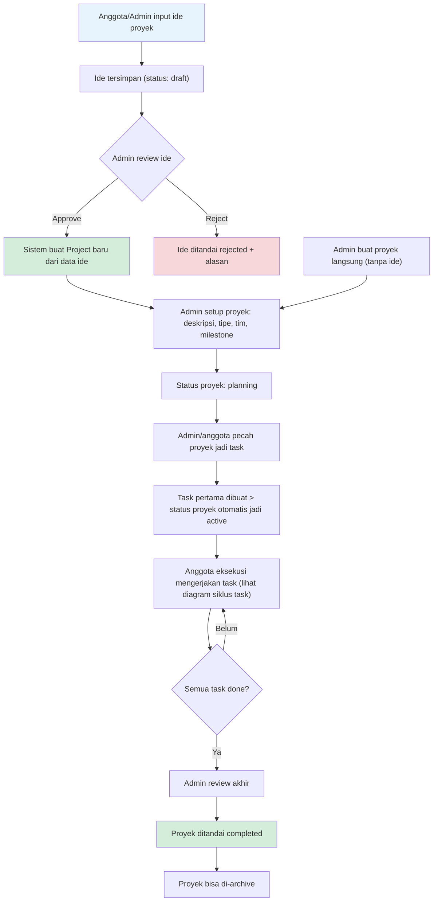
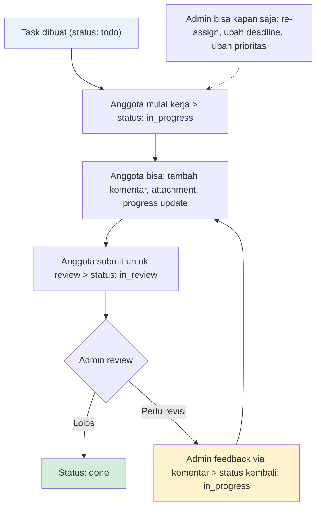
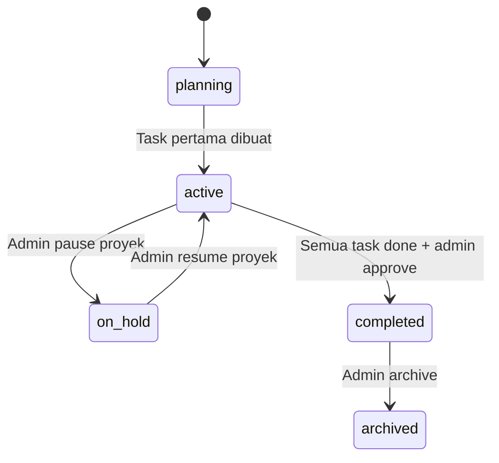
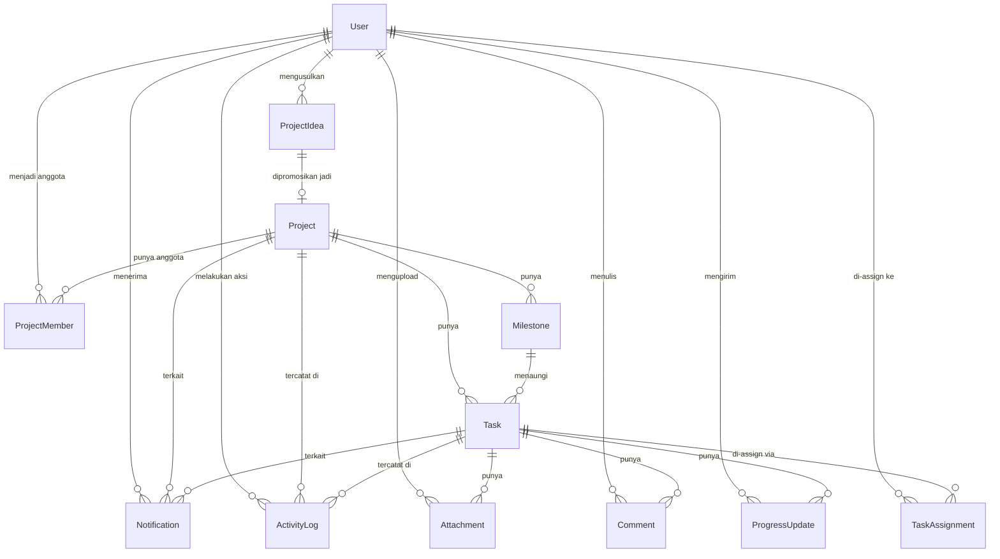

# Perancangan Struktur Sistem Eksekusi WEBI-SPACE

**Disusun oleh:** Celo (partner dan coach Ayunda, PIC Webdev)
**Sifat dokumen:** Spesifikasi teknis alur kerja, struktur data, dan mekanisme monitoring untuk modul Eksekusi. Dokumen ini menjadi acuan langsung bagi tim development saat implementasi (Fase 2.4 di roadmap).
**Cakupan:** Khusus modul Eksekusi (manajemen proyek). Modul Eksplorasi dan WEBI tidak dibahas di sini.

---

## DAFTAR ISI

1. Alur Kerja Tim Eksekusi (Penjelasan Step-by-Step)
2. Diagram Flow Alur Kerja
3. Struktur Data (Tabel per Entitas)
4. Diagram Relasi Antar Entitas
5. Mekanisme Monitoring dan Intervensi Admin
6. Lampiran: Definisi Trigger Activity Log dan Notification

---

## 1. ALUR KERJA TIM EKSEKUSI

### Konteks Tim

Tim eksekusi saat ini berisi 3 orang dengan kapasitas dan komitmen yang tidak merata. Rancangan alur ini dirancang supaya tetap berfungsi walau hanya 1 proyek aktif dengan 1-2 orang yang mengerjakan. Tidak mengasumsikan tim besar dengan banyak proyek paralel.

Profil singkat yang memengaruhi desain alur:
- Ahmad Basir: paling siap dan konsisten, bisa diandalkan untuk task rutin.
- Azmi Renalji: termotivasi oleh proyek yang riil dan relevan ke dunia kerja, minat ke fullstack dan PM.
- Riefki Nugraha: sangat sibuk, lebih cocok dilibatkan di proyek kompetisi/hackathon ketimbang kerja rutin mingguan.

### Tahap 1: Input Ide Proyek

**Aktor:** Semua anggota eksekusi dan admin.

**Proses:**
- Anggota atau admin membuka menu Project Ideas dan mengisi form input ide.
- Data yang diinput: judul ide, deskripsi singkat, tujuan/relevansi (kenapa ide ini layak dikerjakan), dan nama pengusul (otomatis dari akun login).
- Ide tersimpan dengan status `draft`.
- Tidak ada validasi berat di tahap ini. Tujuannya menurunkan barrier supaya siapapun bisa mengusulkan kapan saja, termasuk ide kompetisi/hackathon yang sifatnya mendadak.

**Koneksi ke fitur:**
- Activity Log: mencatat "Ide baru diinput oleh [nama]".
- Project Ideas ditampilkan sebagai daftar yang bisa difilter berdasarkan status (draft/approved/rejected).

### Tahap 2: Seleksi dan Promosi Ide jadi Proyek

**Aktor:** Admin (PIC).

**Proses:**
- Admin me-review daftar ide berstatus `draft` dari menu Project Ideas.
- Admin punya dua aksi:
  - **Approve:** Admin mengubah status ide ke `approved`. Saat ini terjadi, sistem otomatis membuat entitas Project baru dengan data yang di-copy dari ProjectIdea (judul, deskripsi, tujuan, pengusul). Field `promoted_to_project_id` di ProjectIdea terisi otomatis dengan ID proyek yang baru dibuat, menjaga relasi asal-usul yang bisa ditelusuri.
  - **Reject:** Admin mengubah status ide ke `rejected` dan wajib mengisi field `rejection_reason` (alasan penolakan), supaya pengusul tahu kenapa idenya tidak diangkat dan bisa memperbaiki atau mengusulkan ide lain.

**Jalur alternatif:** Admin bisa membuat proyek baru secara langsung tanpa lewat Project Ideas, untuk kasus proyek yang datang dari luar (permintaan organisasi, peluang kompetisi yang ditangkap admin sendiri, atau proyek lanjutan dari periode sebelumnya).

**Koneksi ke fitur:**
- Activity Log: mencatat "Ide [judul] di-approve oleh admin" atau "Ide [judul] di-reject oleh admin".
- Notification: pengusul ide menerima notifikasi saat idenya di-approve atau di-reject.

### Tahap 3: Setup Proyek

**Aktor:** Admin (PIC).

**Proses:**
- Admin melengkapi data proyek yang baru dibuat:
  - Deskripsi detail (bisa lebih lengkap dari deskripsi di ide awal).
  - Tujuan proyek yang terukur.
  - `project_type`: `internal` (proyek reguler divisi) atau `competition` (proyek untuk lomba/hackathon). Pembedaan ini penting karena proyek kompetisi punya karakteristik berbeda: deadline fixed, timeline pendek dan intens.
  - Anggota tim yang terlibat (dipilih dari daftar user dengan role `execution_member`).
  - Tanggal mulai dan target selesai.
- Admin mendefinisikan milestone untuk proyek ini. Setiap milestone punya: judul, deskripsi, dan target tanggal selesai. Contoh untuk proyek web sederhana: "Milestone 1: Setup dan Desain", "Milestone 2: Development Frontend", "Milestone 3: Development Backend", "Milestone 4: Testing dan Deploy".
- Status proyek saat ini: `planning`.

**Koneksi ke fitur:**
- Activity Log: mencatat "Proyek [judul] dibuat" dan "Milestone [judul] ditambahkan".
- Notification: anggota yang ditambahkan ke proyek menerima notifikasi.
- Timeline: milestone yang sudah didefinisikan langsung muncul di tampilan timeline proyek.

### Tahap 4: Pemecahan Proyek jadi Task

**Aktor:** Admin, atau anggota eksekusi yang diberi wewenang oleh admin.

**Proses:**
- Proyek dipecah jadi task-task konkret. Setiap task wajib terhubung ke satu milestone.
- Data per task:
  - Judul task (singkat, deskriptif, contoh: "Buat halaman login", "Setup database schema").
  - Deskripsi (detail apa yang harus dikerjakan).
  - Assignee: siapa yang mengerjakan. Bisa satu orang, bisa lebih dari satu (lewat entitas TaskAssignment).
  - Deadline task.
  - Prioritas: `low`, `medium`, `high`.
  - Status awal: `todo`.
- Saat task pertama dibuat di sebuah proyek, status proyek otomatis berubah dari `planning` ke `active`.
- Task yang dibuat langsung muncul di Kanban board pada kolom "Todo".

**Catatan desain:** Kanban board bukan entitas data terpisah. Kanban adalah representasi visual (view layer) yang membaca field `status` pada entitas Task dan menampilkannya per kolom: Todo, In Progress, In Review, Done.

**Koneksi ke fitur:**
- Kanban board: task baru muncul di kolom Todo.
- Activity Log: mencatat "Task [judul] dibuat oleh [nama]" dan "Task [judul] di-assign ke [nama]".
- Notification: anggota yang di-assign menerima notifikasi "Task baru di-assign ke kamu: [judul task]".

### Tahap 5: Eksekusi Task (Siklus Kerja)

**Aktor:** Anggota eksekusi yang di-assign.

**Proses:**
- Anggota melihat task yang di-assign ke mereka, bisa lewat Kanban board maupun daftar task personal.
- Anggota memulai pengerjaan dengan memindahkan status task dari `todo` ke `in_progress`. Perpindahan ini bisa dilakukan lewat drag-and-drop di Kanban board atau lewat tombol ubah status di detail task.
- Selama mengerjakan, anggota bisa:
  - Menambahkan **komentar** di task untuk berdiskusi, bertanya, atau klarifikasi ke admin/anggota lain.
  - Menambahkan **attachment** (file atau link) di task, misalnya screenshot progres, link deploy preview, atau file desain.
- Setelah selesai mengerjakan, anggota memindahkan status ke `in_review`, menandakan task siap di-review admin.
- Admin me-review. Dua kemungkinan:
  - **Lolos review:** Admin memindahkan status ke `done`.
  - **Perlu revisi:** Admin menambahkan komentar berisi feedback, dan memindahkan status kembali ke `in_progress`. Anggota memperbaiki, lalu submit ulang ke `in_review`.

**Siklus status task:** `todo` > `in_progress` > `in_review` > `done`. Bisa mundur dari `in_review` ke `in_progress` jika perlu revisi.

**Koneksi ke fitur:**
- Kanban board: kartu task berpindah kolom sesuai status.
- Activity Log: setiap perpindahan status tercatat otomatis, termasuk siapa yang memindahkan dan kapan.
- Komentar: melekat di task, kronologis, bisa dari anggota maupun admin.
- Attachment: melekat di task, bisa ditambah kapan saja selama task belum `done`.
- Notification: admin menerima notifikasi saat task dipindah ke `in_review`. Anggota menerima notifikasi saat task dipindah kembali ke `in_progress` (revisi).

### Tahap 6: Pelaporan Progres

**Aktor:** Anggota eksekusi yang di-assign.

**Proses:**
- Selain memindahkan status, anggota diminta mengirim progress update per task. Ini adalah laporan kerja formal yang berbeda dari komentar.
- Data progress update:
  - Isi update (teks: apa yang sudah dikerjakan, kendala yang dihadapi).
  - Attachment opsional (link atau file pendukung).
  - Timestamp otomatis.
- Progress update tercatat sebagai entitas tersendiri (ProgressUpdate) yang terhubung ke task dan user, bukan dicampur dengan komentar.

**Kenapa dipisah dari komentar:** Komentar adalah ruang diskusi bebas (tanya jawab, klarifikasi, catatan). Progress update adalah laporan kerja yang menjadi bahan monitoring admin di dashboard. Kalau dicampur, dashboard monitoring jadi noisy, admin harus menyortir mana yang laporan progres dan mana yang cuma diskusi.

**Koneksi ke fitur:**
- Dashboard admin: progress update terbaru muncul di ringkasan proyek.
- Activity Log: mencatat "Progress update ditambahkan oleh [nama] di task [judul]".
- Notification: admin menerima notifikasi saat ada progress update baru.

### Tahap 7: Monitoring dan Intervensi Admin

**Aktor:** Admin (PIC).

**Proses:**
- Admin memantau lewat dashboard admin yang menampilkan:
  - Ringkasan semua proyek aktif (status, progres per milestone).
  - Daftar task yang butuh perhatian (sinyal peringatan otomatis, detail di Bagian 5).
  - Riwayat progress update terbaru dari semua anggota.
- Berdasarkan data di dashboard, admin bisa mengambil tindakan langsung:
  - **Re-assign task:** jika anggota yang di-assign ternyata tidak bisa melanjutkan (sibuk, tidak responsif), admin bisa memindahkan task ke anggota lain atau mengambil alih sendiri.
  - **Ubah deadline:** jika estimasi awal terlalu ketat atau terlalu longgar.
  - **Tambah komentar intervensi:** menuliskan arahan, feedback, atau teguran langsung di task yang bermasalah.
  - **Ubah prioritas task:** menaikkan prioritas task yang blocking task lain.
  - **Ubah status proyek ke `on_hold`:** jika kapasitas tim sedang tidak memungkinkan untuk melanjutkan proyek. Proyek bisa dikembalikan ke `active` kapan saja.

Detail lengkap mekanisme monitoring ada di Bagian 5.

### Tahap 8: Penyelesaian Proyek

**Aktor:** Admin (PIC).

**Proses:**
- Prasyarat: semua task dalam proyek sudah berstatus `done`.
- Admin melakukan review akhir terhadap keseluruhan proyek.
- Admin menandai proyek sebagai `completed`.
- Setelah completed, proyek bisa di-`archived` untuk referensi riwayat. Proyek yang di-archive tetap bisa dilihat datanya tapi tidak bisa diedit.

**Siklus status proyek (lengkap):**
- `planning`: proyek baru dibuat, milestone sedang didefinisikan, belum ada task.
- `active`: task sudah dibuat dan sedang dikerjakan.
- `on_hold`: proyek sengaja di-pause (bisa kembali ke `active`).
- `completed`: semua task selesai, proyek ditandai selesai oleh admin.
- `archived`: proyek disimpan sebagai arsip, read-only.

Transisi yang diizinkan:
- `planning` > `active` (otomatis saat task pertama dibuat).
- `active` > `on_hold` (manual oleh admin).
- `on_hold` > `active` (manual oleh admin).
- `active` > `completed` (manual oleh admin, syarat: semua task `done`).
- `completed` > `archived` (manual oleh admin).

**Koneksi ke fitur:**
- Activity Log: mencatat "Proyek [judul] ditandai completed oleh admin" dan "Proyek [judul] di-archive".
- Dashboard admin: proyek completed/archived tetap muncul di section terpisah untuk referensi.

---

## 2. DIAGRAM FLOW ALUR KERJA

Diagram di bawah menggunakan sintaks Mermaid flowchart. Dibagi jadi dua diagram: alur utama (dari ide sampai proyek selesai) dan siklus task (detail perpindahan status task).

### 2.1 Alur Utama: Ide sampai Proyek Selesai

### 2.2 Siklus Task (Detail Perpindahan Status)

### 2.3 Transisi Status Proyek

---

## 3. STRUKTUR DATA

### Catatan Umum

- Semua entitas punya field `id` (UUID, primary key), `created_at`, dan `updated_at` (timestamp).
- Field `id`, `created_at`, `updated_at` tidak ditulis ulang di setiap tabel untuk menghindari redundansi. Anggap selalu ada.
- Entitas User merujuk ke tabel user terpusat dari modul autentikasi (Fase 2.1 di roadmap), bukan tabel baru khusus eksekusi. Field yang dicantumkan di sini hanya yang relevan untuk modul eksekusi.
- Tipe data menggunakan notasi umum (string, text, enum, timestamp, uuid, boolean, integer) yang bisa diterjemahkan ke tipe spesifik database manapun.

### 3.1 User (referensi dari modul autentikasi)

| Field | Tipe | Keterangan |
|-------|------|------------|
| id | uuid | PK, dari tabel user terpusat |
| name | string | Nama lengkap |
| email | string | Email, unique |
| role | enum | `admin`, `execution_member`, `exploration_member`. Satu user bisa punya satu role. Di modul eksekusi, hanya `admin` dan `execution_member` yang relevan |
| avatar_url | string, nullable | URL foto profil, opsional |

Catatan: field lain yang dibutuhkan modul autentikasi (password hash, token, dsb) tidak dicantumkan di sini karena bukan urusan modul eksekusi.

### 3.2 ProjectIdea

| Field | Tipe | Keterangan |
|-------|------|------------|
| id | uuid | PK |
| title | string | Judul ide |
| description | text | Deskripsi singkat ide |
| purpose | text | Tujuan/relevansi, kenapa ide ini layak dikerjakan |
| proposed_by | uuid, FK > User.id | Siapa yang mengusulkan |
| status | enum | `draft`, `approved`, `rejected` |
| rejection_reason | text, nullable | Wajib diisi jika status = rejected |
| promoted_to_project_id | uuid, nullable, FK > Project.id | Terisi otomatis saat ide di-approve dan Project dibuat |
| created_at | timestamp | |
| updated_at | timestamp | |

### 3.3 Project

| Field | Tipe | Keterangan |
|-------|------|------------|
| id | uuid | PK |
| title | string | Judul proyek |
| description | text | Deskripsi detail proyek |
| objective | text | Tujuan proyek yang terukur |
| project_type | enum | `internal`, `competition` |
| status | enum | `planning`, `active`, `on_hold`, `completed`, `archived` |
| originated_from_idea_id | uuid, nullable, FK > ProjectIdea.id | Referensi ke ide asal, null jika proyek dibuat langsung tanpa lewat Project Ideas |
| start_date | date | Tanggal mulai proyek |
| target_end_date | date | Target tanggal selesai |
| actual_end_date | date, nullable | Tanggal selesai aktual, diisi saat status jadi `completed` |
| created_by | uuid, FK > User.id | Admin yang membuat proyek |
| created_at | timestamp | |
| updated_at | timestamp | |

### 3.4 ProjectMember

Relasi many-to-many antara Project dan User. Mencatat siapa saja anggota tim di sebuah proyek.

| Field | Tipe | Keterangan |
|-------|------|------------|
| id | uuid | PK |
| project_id | uuid, FK > Project.id | |
| user_id | uuid, FK > User.id | |
| joined_at | timestamp | Kapan anggota ditambahkan ke proyek |

Unique constraint: (project_id, user_id).

### 3.5 Milestone

| Field | Tipe | Keterangan |
|-------|------|------------|
| id | uuid | PK |
| project_id | uuid, FK > Project.id | Milestone milik proyek mana |
| title | string | Judul milestone, contoh: "Setup dan Desain" |
| description | text, nullable | Penjelasan milestone |
| target_date | date | Target tanggal selesai milestone |
| sort_order | integer | Urutan milestone dalam proyek (1, 2, 3, ...) |
| created_at | timestamp | |
| updated_at | timestamp | |

Catatan: progres milestone dihitung secara derived (computed), yaitu persentase task berstatus `done` dari total task yang terhubung ke milestone ini. Tidak disimpan sebagai field karena nilainya selalu berubah dan harus selalu akurat real-time.

### 3.6 Task

| Field | Tipe | Keterangan |
|-------|------|------------|
| id | uuid | PK |
| project_id | uuid, FK > Project.id | Task milik proyek mana |
| milestone_id | uuid, FK > Milestone.id | Task terhubung ke milestone mana. Setiap task wajib terhubung ke satu milestone |
| title | string | Judul task, singkat dan deskriptif |
| description | text, nullable | Detail apa yang harus dikerjakan |
| status | enum | `todo`, `in_progress`, `in_review`, `done` |
| priority | enum | `low`, `medium`, `high` |
| deadline | date | Deadline task |
| created_by | uuid, FK > User.id | Siapa yang membuat task |
| created_at | timestamp | |
| updated_at | timestamp | |

Catatan: field `status` inilah yang dibaca oleh Kanban board untuk menentukan kolom mana sebuah task ditampilkan. Kanban bukan entitas data terpisah.

### 3.7 TaskAssignment

Relasi many-to-many antara Task dan User. Memungkinkan satu task dikerjakan lebih dari satu orang.

| Field | Tipe | Keterangan |
|-------|------|------------|
| id | uuid | PK |
| task_id | uuid, FK > Task.id | |
| user_id | uuid, FK > User.id | Anggota yang di-assign |
| assigned_by | uuid, FK > User.id | Siapa yang meng-assign (biasanya admin) |
| assigned_at | timestamp | Kapan di-assign |

Unique constraint: (task_id, user_id).

### 3.8 ProgressUpdate

| Field | Tipe | Keterangan |
|-------|------|------------|
| id | uuid | PK |
| task_id | uuid, FK > Task.id | Progress update untuk task mana |
| user_id | uuid, FK > User.id | Siapa yang mengirim update |
| content | text | Isi laporan: apa yang sudah dikerjakan, kendala yang dihadapi |
| attachment_url | string, nullable | Link atau path file pendukung, opsional |
| created_at | timestamp | |

Catatan: ProgressUpdate tidak punya `updated_at` karena bersifat append-only (hanya ditambahkan, tidak diedit). Setiap update baru adalah entry baru, bukan edit dari entry sebelumnya. Ini menjaga integritas riwayat pelaporan.

### 3.9 Comment

| Field | Tipe | Keterangan |
|-------|------|------------|
| id | uuid | PK |
| task_id | uuid, FK > Task.id | Komentar di task mana |
| user_id | uuid, FK > User.id | Siapa yang berkomentar |
| content | text | Isi komentar |
| created_at | timestamp | |
| updated_at | timestamp | Bisa diedit (berbeda dari ProgressUpdate) |

### 3.10 Attachment

| Field | Tipe | Keterangan |
|-------|------|------------|
| id | uuid | PK |
| task_id | uuid, FK > Task.id | Attachment di task mana |
| uploaded_by | uuid, FK > User.id | Siapa yang upload |
| file_name | string | Nama file asli, atau label untuk link/catatan teks |
| file_url | text | URL/path file di storage, URL link, atau isi catatan teks |
| file_type | string | MIME type atau ekstensi (contoh: "image/png", "application/pdf"), atau "link", atau "text" |
| file_size | integer, nullable | Ukuran file dalam bytes |
| created_at | timestamp | |

Catatan: attachment mendukung tiga bentuk, bukan hanya file upload (keputusan tahap 1.2, Fiksasi Fitur):
- **File upload**: `file_url` diisi path/URL file di storage, `file_name` diisi nama file asli, `file_type` diisi MIME type/ekstensi, `file_size` diisi ukuran file.
- **Link eksternal**: `file_url` diisi URL-nya, `file_name` diisi judul/label link, `file_type` diisi "link", `file_size` null.
- **Input teks biasa**: `file_url` diisi isi catatan (bisa panjang, kolom bertipe text bukan varchar), `file_name` diisi label catatan, `file_type` diisi "text", `file_size` null.

### 3.11 ActivityLog

| Field | Tipe | Keterangan |
|-------|------|------------|
| id | uuid | PK |
| project_id | uuid, FK > Project.id | Log terkait proyek mana |
| task_id | uuid, nullable, FK > Task.id | Log terkait task mana (null jika log level proyek, misalnya perubahan status proyek) |
| user_id | uuid, FK > User.id | Siapa yang melakukan aksi |
| action_type | enum | Lihat daftar lengkap di Lampiran A |
| description | string | Deskripsi human-readable, contoh: "Ahmad Basir memindahkan status task 'Buat halaman login' dari todo ke in_progress" |
| metadata | json, nullable | Data tambahan terstruktur untuk keperluan query, contoh: `{"old_status": "todo", "new_status": "in_progress"}` atau `{"old_assignee": "user_123", "new_assignee": "user_456"}` |
| created_at | timestamp | Kapan aksi terjadi |

Catatan: ActivityLog bersifat append-only dan immutable. Tidak ada update atau delete. Ini log audit.

### 3.12 Notification

| Field | Tipe | Keterangan |
|-------|------|------------|
| id | uuid | PK |
| recipient_id | uuid, FK > User.id | Siapa yang menerima notifikasi |
| project_id | uuid, nullable, FK > Project.id | Konteks proyek (untuk deep link) |
| task_id | uuid, nullable, FK > Task.id | Konteks task (untuk deep link) |
| type | enum | Lihat daftar lengkap di Lampiran B |
| title | string | Judul notifikasi, contoh: "Task baru di-assign ke kamu" |
| message | string | Isi notifikasi, contoh: "Kamu di-assign ke task 'Buat halaman login' di proyek 'Website RIT'" |
| is_read | boolean | Default: false. Berubah ke true saat user membuka/membaca notifikasi |
| created_at | timestamp | |

---

## 4. DIAGRAM RELASI ANTAR ENTITAS

---

## 5. MEKANISME MONITORING DAN INTERVENSI ADMIN

### 5.1 Dashboard Admin: Apa yang Ditampilkan

Dashboard admin adalah tampilan satu halaman yang memberi gambaran utuh kondisi semua proyek. Berikut komponen-komponennya:

**Komponen A: Ringkasan Proyek Aktif**

Untuk setiap proyek berstatus `active` atau `on_hold`, tampilkan:
- Judul proyek dan tipe (`internal`/`competition`).
- Status proyek.
- Progres keseluruhan: persentase task berstatus `done` dari total task.
- Progres per milestone: bar progres yang menunjukkan berapa persen task di bawah tiap milestone yang sudah `done`.
- Jumlah anggota aktif (yang punya task berstatus `in_progress` atau `in_review`).
- Tanggal target selesai dan sisa hari.

**Komponen B: Daftar Task yang Butuh Perhatian (Alert Panel)**

Panel ini menampilkan task-task yang men-trigger sinyal peringatan otomatis. Urutkan dari yang paling kritis.

**Komponen C: Feed Progress Update Terbaru**

Timeline kronologis progress update terbaru dari semua anggota di semua proyek aktif. Setiap entry menampilkan: nama anggota, judul task, isi update ringkas, dan timestamp. Admin bisa klik untuk masuk ke detail task.

**Komponen D: Ringkasan Aktivitas Anggota**

Per anggota eksekusi, tampilkan:
- Jumlah task yang sedang di-assign (by status: todo, in_progress, in_review, done).
- Tanggal progress update terakhir yang dikirim.
- Jumlah task yang deadline-nya sudah lewat.

### 5.2 Sinyal Peringatan Otomatis (Alert Flags)

Sistem secara otomatis menandai task atau proyek yang butuh perhatian admin berdasarkan kondisi berikut:

**Flag 1: Deadline Terlewat (OVERDUE)**
- Kondisi: `Task.deadline` < tanggal hari ini DAN `Task.status` bukan `done`.
- Tampilan: label merah "OVERDUE" di task card (Kanban dan dashboard).
- Severity: tinggi.

**Flag 2: Deadline Mendekat (DUE SOON)**
- Kondisi: `Task.deadline` dalam 3 hari ke depan (threshold configurable) DAN `Task.status` bukan `done`.
- Tampilan: label kuning "DUE SOON" di task card.
- Severity: sedang.
- Konfigurasi: threshold hari bisa diatur admin lewat settings sistem.

**Flag 3: Task Mandek (STALLED)**
- Kondisi: `Task.status` = `in_progress` DAN tidak ada ProgressUpdate maupun perubahan status di task ini selama 7 hari terakhir (threshold configurable).
- Cara cek: bandingkan `MAX(ProgressUpdate.created_at, ActivityLog.created_at WHERE task_id = task ini)` dengan tanggal hari ini. Jika selisihnya >= threshold, flag STALLED.
- Tampilan: label oranye "STALLED" di task card.
- Severity: sedang-tinggi.

**Flag 4: Anggota Tidak Responsif (INACTIVE MEMBER)**
- Kondisi: seorang anggota punya task berstatus `todo` atau `in_progress`, tapi tidak mengirim progress update apapun DAN tidak melakukan perubahan status apapun di semua task-nya selama 14 hari terakhir (threshold configurable).
- Tampilan: indikator di Ringkasan Aktivitas Anggota (Komponen D).
- Severity: tinggi. Ini sinyal bahwa anggota mungkin sudah tidak aktif dan task-nya perlu di-re-assign.

**Flag 5: Milestone Tertinggal (MILESTONE AT RISK)**
- Kondisi: tanggal hari ini sudah melewati `Milestone.target_date` tapi masih ada task di milestone tersebut yang belum berstatus `done`.
- Tampilan: label merah di timeline milestone.
- Severity: tinggi.

**Flag 6: Proyek Tanpa Aktivitas (PROJECT IDLE)**
- Kondisi: proyek berstatus `active` tapi tidak ada ActivityLog entry apapun di proyek ini selama 14 hari terakhir (threshold configurable).
- Tampilan: indikator di Ringkasan Proyek (Komponen A).
- Severity: tinggi. Ini sinyal bahwa proyek mungkin perlu di-pause (`on_hold`) atau ada masalah mendasar yang perlu diselesaikan.

### 5.3 Tindakan Intervensi Admin

Saat sinyal peringatan muncul, admin bisa mengambil tindakan langsung dari dashboard tanpa perlu berpindah banyak halaman:

**Tindakan 1: Re-assign Task**
- Kapan: task STALLED atau anggota INACTIVE.
- Cara: dari detail task atau alert panel, admin bisa mengubah assignee. Assignment lama dicabut, assignment baru dibuat. Anggota baru menerima notifikasi, anggota lama menerima notifikasi bahwa task-nya dipindahkan.
- Activity Log: mencatat "Admin re-assign task [judul] dari [nama lama] ke [nama baru]".

**Tindakan 2: Ubah Deadline**
- Kapan: estimasi awal terlalu ketat (terutama untuk proyek `competition` yang deadline-nya fixed, maka yang diubah bukan deadline proyek tapi deadline task internal).
- Cara: dari detail task, admin mengubah field `deadline`.
- Activity Log: mencatat "Admin mengubah deadline task [judul] dari [tanggal lama] ke [tanggal baru]".

**Tindakan 3: Tambah Komentar Intervensi**
- Kapan: task butuh arahan tambahan, atau admin perlu memberi feedback/teguran.
- Cara: dari detail task, admin menulis komentar. Komentar admin tampil sama seperti komentar anggota, tidak perlu pembedaan visual khusus karena nama pengirim sudah jelas.
- Notification: anggota yang di-assign menerima notifikasi "Komentar baru dari admin di task [judul]".

**Tindakan 4: Ubah Prioritas Task**
- Kapan: ada task yang blocking task lain, atau situasi berubah sehingga urgensi bergeser.
- Cara: dari detail task atau Kanban board, admin mengubah field `priority`.
- Activity Log: mencatat "Admin mengubah prioritas task [judul] dari [lama] ke [baru]".

**Tindakan 5: Pause Proyek (On Hold)**
- Kapan: kapasitas tim sedang tidak memungkinkan (misalnya periode UTS/UAS, atau semua anggota sedang sangat sibuk dengan kesibukan lain). Ini penting mengingat profil tim yang kapasitasnya tidak merata.
- Cara: dari detail proyek atau dashboard, admin mengubah status proyek ke `on_hold`.
- Efek: proyek tetap terlihat di dashboard tapi dipindah ke section "On Hold". Task-task di dalamnya tidak dihapus, hanya dibekukan sementara. Notifikasi deadline dan alert flag untuk proyek ini di-suppress selama status `on_hold`.
- Resume: admin bisa mengubah status kembali ke `active` kapan saja. Saat di-resume, deadline task yang sudah lewat selama masa pause perlu di-update manual oleh admin.

**Tindakan 6: Ambil Alih Task**
- Kapan: kasus darurat di mana tidak ada anggota yang bisa mengerjakan dan task harus selesai.
- Cara: admin meng-assign task ke dirinya sendiri. Secara sistem, admin diperlakukan sama seperti anggota untuk keperluan assignment.

### 5.4 Notifikasi untuk Admin

Selain sinyal peringatan di dashboard, admin juga menerima notifikasi aktif untuk event tertentu:
- Task berpindah ke status `in_review` (ada yang minta di-review).
- Progress update baru dikirim oleh anggota.
- Ide baru diinput di Project Ideas.
- Flag OVERDUE, STALLED, atau INACTIVE MEMBER pertama kali muncul di sebuah task/anggota.

---

## LAMPIRAN A: DEFINISI TRIGGER ACTIVITY LOG

Berikut daftar lengkap `action_type` yang dicatat di ActivityLog:

| action_type | Trigger | Contoh description |
|-------------|---------|-------------------|
| `idea_created` | Anggota/admin menginput ide baru di Project Ideas | "Ahmad Basir menginput ide: Website Portfolio RIT" |
| `idea_approved` | Admin meng-approve ide | "Admin meng-approve ide: Website Portfolio RIT" |
| `idea_rejected` | Admin me-reject ide | "Admin me-reject ide: Aplikasi Kasir. Alasan: di luar scope divisi" |
| `project_created` | Proyek baru dibuat (dari ide atau langsung) | "Proyek 'Website Portfolio RIT' dibuat oleh admin" |
| `project_status_changed` | Status proyek berubah | "Status proyek 'Website Portfolio RIT' diubah dari active ke on_hold" |
| `project_member_added` | Anggota ditambahkan ke proyek | "Ahmad Basir ditambahkan ke proyek 'Website Portfolio RIT'" |
| `project_member_removed` | Anggota dikeluarkan dari proyek | "Riefki Nugraha dikeluarkan dari proyek 'Website Portfolio RIT'" |
| `milestone_created` | Milestone baru dibuat | "Milestone 'Setup dan Desain' ditambahkan ke proyek 'Website Portfolio RIT'" |
| `task_created` | Task baru dibuat | "Task 'Buat halaman login' dibuat oleh admin" |
| `task_status_changed` | Status task berubah | "Ahmad Basir memindahkan task 'Buat halaman login' dari todo ke in_progress" |
| `task_assigned` | Task di-assign ke anggota | "Task 'Buat halaman login' di-assign ke Ahmad Basir" |
| `task_reassigned` | Task di-re-assign ke anggota lain | "Task 'Buat halaman login' di-re-assign dari Riefki ke Ahmad Basir" |
| `task_deadline_changed` | Deadline task diubah | "Deadline task 'Buat halaman login' diubah dari 15 Jul ke 22 Jul" |
| `task_priority_changed` | Prioritas task diubah | "Prioritas task 'Buat halaman login' diubah dari low ke high" |
| `task_deleted` | Task dihapus | "Task 'Buat halaman login' dihapus oleh admin" |
| `comment_added` | Komentar baru di task | "Ahmad Basir menambahkan komentar di task 'Buat halaman login'" |
| `attachment_added` | Attachment baru di task | "Ahmad Basir menambahkan attachment di task 'Buat halaman login'" |
| `progress_update_added` | Progress update baru di task | "Ahmad Basir mengirim progress update di task 'Buat halaman login'" |

---

## LAMPIRAN B: DEFINISI TRIGGER NOTIFICATION

Berikut daftar lengkap `type` notifikasi dan kapan masing-masing dikirim:

| type | Trigger | Penerima | Contoh message |
|------|---------|----------|----------------|
| `task_assigned` | Task di-assign ke anggota | Anggota yang di-assign | "Kamu di-assign ke task 'Buat halaman login' di proyek 'Website RIT'" |
| `task_reassigned_to` | Task di-re-assign, notifikasi ke anggota baru | Anggota baru | "Task 'Buat halaman login' di-re-assign ke kamu dari Riefki" |
| `task_reassigned_from` | Task di-re-assign, notifikasi ke anggota lama | Anggota lama | "Task 'Buat halaman login' yang sebelumnya di-assign ke kamu sudah dipindahkan ke Ahmad Basir" |
| `task_deadline_approaching` | Deadline task tinggal <= threshold hari | Anggota yang di-assign | "Deadline task 'Buat halaman login' tinggal 2 hari lagi (15 Jul)" |
| `task_overdue` | Deadline task terlewat | Anggota yang di-assign + admin | "Task 'Buat halaman login' sudah melewati deadline (15 Jul)" |
| `task_status_to_review` | Task berpindah ke status in_review | Admin | "Ahmad Basir meminta review untuk task 'Buat halaman login'" |
| `task_revision_needed` | Task dikembalikan ke in_progress dari in_review | Anggota yang di-assign | "Task 'Buat halaman login' perlu revisi. Cek komentar admin" |
| `comment_from_admin` | Admin menambahkan komentar di task | Anggota yang di-assign di task itu | "Admin menambahkan komentar di task 'Buat halaman login'" |
| `comment_on_my_task` | Siapapun menambahkan komentar di task yang aku di-assign | Semua anggota yang di-assign di task itu (kecuali penulis komentar sendiri) | "Ahmad Basir berkomentar di task 'Buat halaman login'" |
| `progress_update_received` | Anggota mengirim progress update | Admin | "Ahmad Basir mengirim progress update di task 'Buat halaman login'" |
| `idea_status_changed` | Ide di-approve atau di-reject | Pengusul ide | "Ide kamu 'Website Portfolio RIT' sudah di-approve dan menjadi proyek aktif" |
| `added_to_project` | Anggota ditambahkan ke proyek | Anggota yang ditambahkan | "Kamu ditambahkan ke proyek 'Website Portfolio RIT'" |
| `project_status_changed` | Status proyek berubah | Semua anggota proyek | "Status proyek 'Website Portfolio RIT' diubah ke on_hold" |
| `stalled_task_alert` | Task terdeteksi STALLED (pertama kali) | Admin | "Task 'Buat halaman login' tidak ada aktivitas selama 7 hari" |
| `inactive_member_alert` | Anggota terdeteksi INACTIVE (pertama kali) | Admin | "Riefki Nugraha tidak ada aktivitas di semua task selama 14 hari" |

---

## CATATAN PENUTUP

Dokumen ini mencakup tiga deliverable yang diminta:

1. **Alur kerja tim eksekusi dari awal sampai akhir** (Bagian 1 dan 2): delapan tahap dari input ide sampai archive proyek, dengan diagram flow menggunakan sintaks Mermaid.

2. **Struktur data proyek** (Bagian 3 dan 4): dua belas entitas dengan semua field, tipe data, dan relasi. Termasuk ER diagram.

3. **Mekanisme monitoring dan intervensi admin** (Bagian 5): dashboard admin dengan empat komponen tampilan, enam jenis sinyal peringatan otomatis dengan kondisi trigger yang konkret, dan enam jenis tindakan intervensi.

Semua fitur yang sudah difiksasi (Kanban board, komentar, activity log, attachment, notifikasi, timeline/milestone, project ideas, dashboard monitoring, update progres) sudah terhubung ke alur kerja utama, bukan didefinisikan terpisah.

Batasan yang disepakati tetap dihormati: tidak ada integrasi GitHub otomatis, dan sistem ini khusus untuk proyek internal webdev RIT.